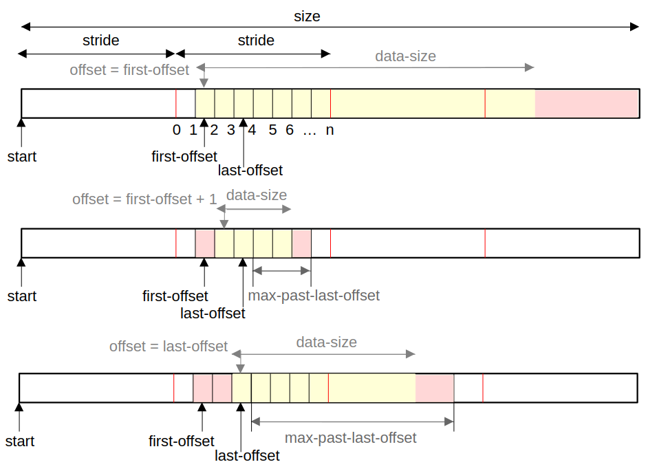

.. only:: builder_html or builder_simplepdf

  .. |nbsp| unicode:: 0xA0
     :trim:

  .. contents::

.. rst-class:: break_before

Snippy Documentation (|release|)
################################

Overview
========

LLVM-snippy is a random test generator (RTG) based on LLVM. It currently only supports RISC-V, but is potentially target-independent.

LLVM-snippy generates snippets |nbsp| -- |nbsp| sequences of randomly selected machine instructions with randomly selected registers, immediates, and other attributes that you configure via `histograms <#histogram>`__ and organize via `sections <#sections>`__.

.. important::

   The examples in this guide are currently for RISC-V only, even for
   the features that are target-independent. We will be adding more
   examples once more targets become available.

.. _`_disclaimers_on_versioning`:

Disclaimers on Versioning
-------------------------

LLVM-snippy versioning works as follows:

-  Settings that are compatible with one minor version are always
   compatible with any other minor version. Example: any configuration
   that works in 1.3, will work in 1.7, and any newer 1.x version.

-  The same snippy version with the configuration that has the same seed
   value for one platform works for any other platform. Example: any
   configuration for snippy 1.7 and ``seed=42`` will generate the same
   snippet on Ubuntu and CentOS.

-  Different snippy versions for the same seed value do not generate the
   same snippet. Example: the same configuration with ``seed=42`` will
   generate different snippets for snippy 1.3 and 1.7.

.. important::

   No ISG is a ready-made verification solution. Implementing any
   solution requires additional work.

.. _`_input`:

Input
-----

You run snippy based on one or more YAML configuration files you
provide. In the configuration file(s), you specify:

-  Memory sections available for read, read and write, read and execute

-  Histogram of the probabilities of instructions

-  Memory access

-  Branches

-  Options

-  Initial state

If you run snippy based on more than one YAML file, it will concatenate all
of the specified and included files and parse it as a single YAML document.
As snippys configuration consists of several top-level YAML keys each of
them should appear no more than once through all of the input files.

.. note::
  You can print resulting "preprocessed" configuration using **-E** option

.. _`_output`:

Output
------

The snippy output includes:

-  An relocatable ELF file with a generated snippet. File name is specified via
   **-o** option (default is the name of your config file with ".elf"
   suffix appended). To properly use the generated snippet, you must link
   against it using the generated linker script (see below).

-  An optional execution trace of generated snippet. The trace is only
   generated if simulator model was provided. You can specify the file
   to output trace with **-trace-log** option (Default is stdout).

-  A `linker script file <#generated-linker-script>`__. The name of
   file equals to the name of generated ELF file with ".elf" suffix
   replaced with ".ld". It is required, for example, with `global
   constants <#global-constants>`__.

-  Dump of the registers state after execution. To produce the register
   state use **--dump-registers-yaml** option. See
   `Final Registers State <#final-registers-state>`__.

-  Dump of the registers state before execution. To produce the the
   register state use **--dump-initial-registers-yaml** option.
   See `Dumping Initial
   Registers State <#dumping-initial-registers-state>`__.

Running Snippy
==============

You run snippy using the following as an argument or arguments:

-  A single YAML file. This approach is preferred. You specify all the
   configuration details in one file and use it as a single argument to
   run snippy on without having to provide numerous settings via the
   command line.

-  Two or more YAML files. When running, snippy merges the data from the
   files together and uses the resulting configuration as the layout for
   your output snippet.

You can see all available snippy parameters and options in its embedded
help. To open it, run:

::

   llvm-snippy --help

To run snippy:

1. Create one or more configuration files with all the required data in
   the snippy root directory. The mandatory keys of a snippy
   configuration are `sections <#sections>`__ and
   `histogram <#histogram>`__.

2. `Add the "options" key with the options to run snippy on <#adding-options>`__.

3. Run the configuration file(s):

   ::

      llvm-snippy <config>.yaml

   where ``<config>`` is the name of the configuration file you created.
   If you have more than one configuration file you want to run, list
   them as follows:

   ::

      llvm-snippy <config1>.yaml <config2>.yaml <config3>.yaml

4. If necessary, `print the output <#printing-snippy-output>`__.

.. _`_adding_options`:

Adding Options
--------------

You specify `options <#options>`__ to run snippy on in the
configuration file(s) under the ``options`` key. Though the ``options``
key is not mandatory, if you decide to add them, the preferred approach
is to have them all in one place.

Alternatively, you can specify the options via the command line when
running snippy, though it is a less preferable approach. As with several
configuration files, if you provide several command-line options, snippy
then combines and adds them to the resulting configuration. For example:

::

   llvm-snippy <options_part1> <file1>.yaml <options_part2> <file2>.yaml

.. important::

   The syntax of specifying options in a YAML file and in the command
   line is different. As the preferred approach is to provide options
   via a configuration file, all the examples in this guide present the
   respective format. However, for some options, the guide provides
   examples of both approaches.

For the details on the options and how you can specify them, refer to
the `respective section <#options>`__ of this guide.

.. _`_limitations`:

Limitations
~~~~~~~~~~~

-  You cannot specify the same option in the command line and in YAML.
   Specifying an option via a YAML file is preferred.

-  You cannot specify an option more than once in a YAML file.

.. _`_printing_snippy_output`:

Printing Snippy Output
~~~~~~~~~~~~~~~~~~~~~~

If you want to verify everything is correct and the way you want it to
be, you can dump the resulting snippy configuration after it is
pre-processed using the following command-line option:

::

   llvm-snippy <config1>.yaml <config2>.yaml <config3>.yaml -E

.. _`_yaml_layout`:

YAML Layout
===========

.. important::

   As described in the `Running Snippy <#running-snippy>`__ chapter,
   the configuration you run through snippy can consist of one or more
   YAML files. For clarity, in the further chapters of this guide, we
   use the term **(configuration) layout** to describe the resulting
   layout of the configuration, regardless of whether you provide it via
   one or several YAML files.

The configuration layout must have the following mandatory keys:

-  `sections <#sections>`__ with at least one RX section and one RW
   section.

-  `histogram <#histogram>`__ with at least one instruction.

You can specify the keys directly or via includes, but all keys of the
configuration must be unique. For the details on includes, refer to
`Sublayouts <#sublayouts>`__.

.. _`_layout_example`:

Layout Example
--------------

Following is an example of the configuration layout that contains:

-  Mandatory ``sections`` and ``histogram`` keys

-  Optional ``options`` key

.. code:: yaml

   sections:
       - name:        1
         VMA:       0x10000
         SIZE:      0x10000
         LMA:       0x10000
         ACCESS:    rx
         PHDR:      'header1'
       - name:        2
         VMA:       0x20000
         SIZE:      0x200
         LMA:       0x20000
         ACCESS:    rw
         PHDR:      'header2'

   histogram:
       - [ADD, 1.0]
       - [ADDI, 1.0]
       - [SUB, 1.0]
       - [SRA, 1.0]
       - [SRAI, 1.0]
       - [SRL, 1.0]
       - [SRLI, 1.0]
       - [SLL, 1.0]
       - [SLLI, 1.0]
       - [AND, 1.0]
       - [ANDI, 1.0]
       - [OR, 1.0]
       - [ORI, 1.0]
       - [XOR, 1.0]
       - [XORI, 1.0]
       - [LW, 10.0]
       - [SW, 10.0]

   options:
       mtriple: "riscv64-unknown-elf"
       mcpu: generic-rv64
       march: "rv64ifc_zifencei"
       model-plugin: None

You may try layout-example.yaml from examples on github or from yml/ and share/examples/ folder in this release as follows and disassemble to see generated snippet.

::

   llvm-snippy --num-instrs=1000 --seed=1 yml/layout-example.yaml \
      -o layout-example-1000.elf
   objdump -d layout-example-1000.elf >& layout-example-1000.dis

As set by the ``rx`` and ``rw`` access parameters ``sections``, snippy will write the code to section ``1``, and loads/stores will go to/from section ``2``.

Better always specify seed for reproducibility. If you dont, then snippy will show you which was used.

In this example, ``options`` are:

**-mtriple**

Target architecture specification, mandatory. Snippy is potentially
multi-target. In further releases, snippy will support a number of arch
specifications (x86, ARM, etc).

**-mcpu**

CPU model. If empty, snippy auto-detects it.

**-march**

RISC-V ISA string for which to generate the code. The
value must be in lowercase. For the list of supported
extensions, refer to the `Supported Extensions <#supported-extensions>`__ chapter of this guide.

Alternatively, instead of ``march``, you can use the
``mattr`` option: in the case with the example above,
it is ``+f,+c,+zifencei``.

**-mattr**

Indicates which attributes to include (``+``) or exclude (``-``). For example:

-  If you want to exclude atomics, use ``-mattr=-a``.

-  If you want to include vector instructions (V extension), use ``-mattr=+v``.

**-model-plugin**

Hardware model plugin you want to use. Available
options:
-  Path to the model plugin

-  ``None`` (default) |nbsp| -- |nbsp| Disables snippet execution on
   a model.

**-num-instrs**

Number of instructions to generate. The resulting
snippet contains more instructions due to the
supporting ones.

To generate a full section, use the
``-num-instrs=all`` option |nbsp| -- |nbsp| it fills the executable
section with instructions and generates them until
the target executable section is full.

::

   llvm-snippy --num-instrs=all --seed=1 layout-example.yaml \
      -o layout-example-all.elf
   objdump -d layout-example-all.elf >& layout-example-all.dis

.. important::
  You cannot use this mode with the following features:

  -  Branches

  -  Self-check

  -  Burst mode

**-seed**

Seed for the instruction generation. If you do not
provide this option, snippy picks a random value.

Snippy considers programs with the same options and
seeds as equal within the same version.

**-trace-log**
Execution trace: standard output (stdout) is
redirected to the ``snippy.trace`` file.

Redirection is shell-dependent and optional. If not
redirected, a console output is provided. Trace format
depends on the model plugin you use. For more details,
refer to `Execution Log <#execution-log>`__. The
execution trace is omitted if no-model is specified.

You can find various layout example files in the ``./yml`` directory and
use them as templates for your configurations.

.. _`_top_level_layout_keys`:

Top-Level Layout Keys
---------------------

Top-level keys provide all the configuration parameters for your snippy run.

Although you can run snippy on more than one YAML file, you cannot
divide the same top-level key into more than one YAML file or have the
same top-level key in several files. For example, if you provide the
``sections`` configuration in more than one file, snippy will only take
the configuration from the first file in the run, and will ignore any
other mentions of ``sections``.

Top-level keys cover the following YAML configurations:

-  `Basic configuration <#basic-configuration>`__

-  `Memory configuration <#memory-configuration>`__

-  `Advanced configuration <#advanced-configuration>`__

You select the keys depending on how complex you want your YAML
configuration for snippy to be.

.. _`_sublayouts`:

Sublayouts
----------

You can also use sublayouts using the ``include`` key in your YAML
configuration file of via the command line. For example:

.. code:: yaml

   include:
   - sublayout-sections.yaml

   options:
     mtriple: riscv64-unknown-elf
     mcpu: generic-rv64
     march: "rv64g"
     num-instrs: 1000

   histogram:
     - [FMUL_D, 1.0]

All keys of the configuration must be unique. This way, you need to
verify your sublayouts do not duplicate the keys you provide otherwise.
For example, if you provide ``sections`` and ``histogram`` in a "main"
configuration file, you cannot have the same keys in any sublayout files
that you use with this configuration one.

Snippy adds a relative path to the "main" layout to all its includes. To
add an extra directory where to look for include files, use the
``--layout-include-dir`` option. You can specify this option more than
once for different directories.

.. important::

   If you use the same opcode more than once for ``histogram``, the
   program displays a warning but does not stop the processing. In such
   a case, snippy takes the required relative weight from the last
   mentioned place (i.e., from the last sublayout file that contains
   this opcode).

   If you use the same ``section`` more than once or if they intersect,
   the program reports an error and stops the processing.

.. _`_contents_of_sublayouts`:

Contents of Sublayouts
~~~~~~~~~~~~~~~~~~~~~~

A sublayout file can include:

-  Both ``sections`` and ``histogram``.

   .. container:: formalpara-title

      **Example of ``layout-toplevel.yaml``:**

   ::

      include:
        - sublayout-hist.yaml
        - sublayout-sections.yaml

-  Only ``sections``.

   .. container:: formalpara-title

      **Example of ``sublayout-sections.yaml``:**

   ::

      sections:
        - name:      1
          VMA:       0x210000
          SIZE:      0x100000
          LMA:       0x210000
          ACCESS:    rx
        - name:      2
          VMA:       0x100000
          SIZE:      0x100000
          LMA:       0x100000
          ACCESS:    rw

-  Only ``histogram``.

   .. container:: formalpara-title

      **Example of ``sublayout-hist.yaml``:**

   ::

      histogram:
          - [ADD, 1.0]
          - [ADDI, 1.0]
          - [SUB, 1.0]
          - [SRA, 1.0]
          - [SRAI, 1.0]
          - [SRL, 1.0]
          - [SRLI, 1.0]
          - [SLL, 1.0]
          - [SLLI, 1.0]
          - [AND, 1.0]
          - [ANDI, 1.0]
          - [OR, 1.0]
          - [ORI, 1.0]
          - [XOR, 1.0]
          - [XORI, 1.0]
          - [LW, 10.0]
          - [SW, 10.0]

.. _`_running_snippy_with_sublayouts`:

Running Snippy with Sublayouts
~~~~~~~~~~~~~~~~~~~~~~~~~~~~~~

.. note::

   For presentation purposes, the step below assumes that:

   1. The name of the main layout file you provide is ``main.yaml``.

   2. The ``main.yaml`` file contains all the necessary options, so you
      do not need to provide them via the command line.

   3. You want to use ``memory.yaml`` that comes with the snippy package
      as a sublayout for the memory scheme.

In the snippy root directory, run:

::

   ./llvm-snippy main.yaml ./yml/memory.yaml

.. _`_basic_configuration`:

Basic Configuration
===================

Mandatory keys of a basic configuration for snippy are
`sections <#sections>`__ and `histogram <#histogram>`__.
Additionally, as a part of your basic configuration for snippy, you can
provide details for `immediate histograms <#immediate-histograms>`__
and `FPU <#fpu-configuration>`__.

.. _`_sections`:

Sections
--------

The ``sections`` key provides a list of sections for the output file
with the following details for each entry:

-  ``name`` |nbsp| -- |nbsp| Section number (in previous versions, ``no``).

   .. note::

      ``no`` is currently deprecated, but still supported. It will be
      fully disabled in the future releases, so we recommend using
      ``name``.

-  ``VMA`` |nbsp| -- |nbsp| Virtual memory address

-  ``SIZE`` |nbsp| -- |nbsp| Section size

-  ``LMA`` |nbsp| -- |nbsp| Load memory address

-  ``ACCESS`` |nbsp| -- |nbsp| Access type indication (``r``, ``rx``, ``rw``, ``rxw``)

   Each RW section uses a default memory scheme (aligned): each and
   whole section is addressed aligned by the subtarget information.

   You can use different memory access schemes for different sections
   within a single layout |nbsp| -- |nbsp| in this case, you need to provide additional
   memory schemes. For the details, refer to `Memory
   Scheme <#memory-scheme>`__.

   If present, snippy places the code in the executable sections.

-  ``PHDR`` (optional) |nbsp| -- |nbsp| Program header you assign to the current
   section. Program headers (or segments) describe how the program must
   be loaded into memory and help distinguish between sections (for
   example, sections with the same access type).

   You can provide the value for ``PHDR`` in two ways:

   -  Manually for each section in the layout.

   -  Using the ``-enable-phdrs-definition`` setting. If you set it to
      ``true``, snippy defines all the program headers that are used by
      the sections in the layout in the linker script.

      Regardless of how you provide the ``PHDR`` values, snippy outputs
      them into the resulting ELF file with the respective section
      information.

.. _`_histogram`:

Histogram
---------

The ``histogram`` key covers a list of instructions you want snippy to
use and their relative weights (floating point).

For certain architecture configurations, you must set the names of
instructions the same way as in the machine description. For the
details, refer to `Operation Codes for Specific
Architecture <#operation-codes-for-specific-architecture>`__ below.

The ``histogram`` key supports regex. For example:

::

   histogram:
     - ["ADDI?", 1.0]
     - ["VSSEG.*E32_V", 1.0]
     - ["(VSSE16_V)|(VSSE32_V)", 1.0]
     - ["VSSE.*", 2.0]

.. _`_immediate_histograms`:

Immediate Histograms
--------------------

In your layout, use the ``imm-hist`` key to specify what immediate
values to use for instructions and their probability. For example, you
can use it to generate load-from-load sequences.

You can specify:

-  General immediate histograms. For example:

   .. code:: yaml

      imm-hist:
        - [-1, 1.0]
        - [2, 1.0]
        - [3, 1.0]

-  Immediate histograms for each opcode or opcode regex pattern. For
   example:

   .. code:: yaml

      imm-hist:
        opcodes:
          - "ADDI":
            - [1, 1.0]
            - [2, 1.0]
          - "ADDI?":
            - [3, 1.0]
          - ".+": uniform

   This example sets to generate ADDI that matches against the first
   ``"ADDI"`` regex, even though it also matches against the next two
   entries (``"ADDI?"`` and ``".+"``), as it is the first one in the
   configuration that matches this particular opcode. This way, ADDI’s
   immediates with this configuration can only be either 1 or 2.

You can find sample layouts that include ``imm-hist`` keys for different
configurations in the ``./yml`` directory.

::

   ./llvm-snippy ./yml/layout-example.yaml -seed=1 ./yml/imm-hist.yaml

.. _`_operation_codes_for_specific_architecture`:

Operation Codes for Specific Architecture
~~~~~~~~~~~~~~~~~~~~~~~~~~~~~~~~~~~~~~~~~

To obtain opcodes available for a certain architecture machine
description, run:

::

   ./llvm-snippy -mtriple=riscv64-unknown-elf -mcpu=<processor_model> \
      -march=<ISA_string> --list-opcode-names

See the list of supported instructions for ``march`` `here <#supported-extensions>`__.

.. _`_fpu_configuration`:

FPU Configuration
-----------------

You can control settings for floating point unit (FPU) using the
``fpu-config`` key in your layout.

NaN overwriting
~~~~~~~~~~~~~~~

By default, code generated by snippy makes most of the floating-point
values "at flight" to be NaNs due to randomization. That makes most of
the floating point operations very similar: their operands are very
likely to be a NaN value.

To reduce the percentage of NaN operands, use the NaN control feature.
To do this, specify the range of values to be used to overwrite NaNs in
the ``overwrite`` key in ``fpu-config``.

The NaN overwriting feature is intended to reduce the number of NaNs thereby
increasing the diversity of results of floating-point operations. The settings
of this feature are specified under the ``fpu-config.overwrite`` key.
These settings define:

-  When NaN overwriting should happen (``mode`` and ``nan-rewrite-ratio`` keys),
-  What values should be used to overwrite NaNs
   (``range``, ``ieee-single.valuegram``, ``ieee-double.valuegram``)

See an example below.

.. container:: formalpara-title

   **fpu-config.yaml:**

.. code:: yaml

   fpu-config:
     overwrite:
       range:
         min: -9223372036854775808
         max: 9223372036854775807
         weight: 1.0
         rounding-mode: rup
       ieee-single:
         valuegram:
           - [0x7f800000, 1.0]
           - [0x80000000, 1.0]
           - type: bitrange
             min: 0x7f800000
             max: 0x80000000
             weight: 1.0
       ieee-double:
         valuegram:
           - [0x7ff8000000000000, 1.0]
           - [0x8000000000000000, 1.0]
           - type: bitrange
             min: 0x7ff8000000000000
             max: 0x8000000000000000
       mode: if-any-operand

where you define the ``overwrite`` settings by the following:

-  ``range``

   -  ``min``, ``max``, ``weight`` |nbsp| -- |nbsp| Specific range of the values to
      use. ``weight`` is optional and ``1.0`` by default.

   -  ``rounding-mode`` |nbsp| -- |nbsp| FPU rounding directions according to the IEEE
      standard. You can use both abbreviated options and their aliases:

      -  ``rup`` |nbsp| -- |nbsp| ``toward-positive``

      -  ``rdn`` |nbsp| -- |nbsp| ``toward-negative``

      -  ``rtz`` |nbsp| -- |nbsp| ``toward-zero``

      -  ``rne`` |nbsp| -- |nbsp| ``nearest-ties-to-even``

      -  ``rmm`` |nbsp| -- |nbsp| ``nearest-ties-to-away``

-  ``valuegram`` for ``ieee-single`` (single precision), ``ieee-double``
   (double precision), ``ieee-half`` (half precision, for ``zfh`` only).
   For the details on valuegrams, refer to the `Value Histogram
   (Valuegram) <#value-histogram-valuegram>`__ chapter.

-  ``mode`` |nbsp| -- |nbsp| Heuristic that determines which register is a NaN and must
   be overwritten. The following options are available:

   -  ``if-all-operands`` |nbsp| -- |nbsp| A register is considered a NaN if all of its
      input registers are potentially NaNs.

   -  ``if-any-operand`` |nbsp| -- |nbsp| A register is considered a NaN if any of its
      input registers are potentially NaNs.

   -  ``if-model-detected-nan`` |nbsp| -- |nbsp| The model plugin detected this
      register to be a NaN.

   -  ``disabled`` |nbsp| -- |nbsp| ``overwrite`` is disabled.

Additionally, you can use the existing ``fpu-config.yaml`` file in the
``./yml`` directory as is or as a template for your own configuration.

-  ``nan-rewrite-ratio`` sets the threshold when NaN overwriting should happen.

  The ``threshold`` is a the proportion of NaN registers among all registers
  (tracked separately for each class of registers). For example, if
  ``nan-rewrite-ratio`` is 0.25, then NaN overwriting happens as soon as snippy
  detects that 8 or more registers (either single, double or half precision)
  have become NaNs (8 / 32 = 0.25).

  This key is optional, default value is 0 (a register is overwritten as
  soon as its value is considered a NaN). Non-zero value extends the lifetime
  of NaNs, which increases the probability of nontrivial results of
  floating-point operations.

You can use the existing ``fpu-config.yaml`` file in the ``./yml`` directory as is
or as a template for your own configuration.

.. _`_memory_configuration`:

Memory Configuration
====================

Memory configuration provides extensive features for describing the way
you want memory to be accessed, and includes keys for:

-  `Memory scheme <#memory-scheme>`__

-  `Burst mode <#burst-mode>`__

.. _memory-scheme:

Memory Scheme
-------------

A memory scheme is a mechanism that describes which memory addresses the
snippet can access. You provide the memory scheme in one of the
configuration files. Use the ``access-*`` keys (for example,
``access-ranges``, ``access-evictions``, ``access-addresses``) in your
YAML file to provide a memory scheme for your configuration. You can
also `combine your memory scheme into
groups <#memory-scheme-groups>`__.

You can use the files in ``./yml`` as templates for your memory scheme.
For example, the ``memory-aligned.yaml`` file for an example of an
aligned access.

.. important::

   If you do not provide a memory scheme option, snippy generates memory
   accesses anywhere in an RW section specified by the layout.

.. _`_selecting_applicable_memory_schemes`:

Selecting Applicable Memory Schemes
~~~~~~~~~~~~~~~~~~~~~~~~~~~~~~~~~~~

Snippy selects applicable memory schemes to use based on the following
information that you provide:

-  Maximum size in bytes of each memory access |nbsp| -- |nbsp| that is, how much you
   need the instruction to load (``access-size``).

   For example, a memory scheme has the access size set to ``2``, and
   you provide the following:

   -  ``LB`` (load byte) |nbsp| -- |nbsp| Access size 1 byte

   -  ``LH`` (load, half-word) |nbsp| -- |nbsp| Access size 2 bytes

   -  ``LW`` (load-word) |nbsp| -- |nbsp| Access size 4 bytes

   -  ``LD`` (load double word) |nbsp| -- |nbsp| Access size 8 bytes

      In this case, only the ``LB`` and ``LH`` instructions can use
      addresses from this memory scheme.

   For more details on the rules of vector instructions, refer to `RVV
   Instructions in Memory
   Schemes <#rvv-instructions-in-memory-schemes>`__.

-  Alignment. Though alignment is not a parameter of memory schemes, you
   must consider it when it is required in the instruction (for example,
   with ``riscv-disable-misaligned-access`` set to ``true``). In this
   case, addresses that are not aligned at least on the instruction
   access size will not be used.

.. _`_rvv_instructions_in_memory_schemes`:

RVV Instructions in Memory Schemes
~~~~~~~~~~~~~~~~~~~~~~~~~~~~~~~~~~

Vector instructions work on a group of elements simultaneously.

Snippy supports the following memory-related vector instructions:

-  `Strided load/store <#strided-loadstore>`__

-  `Unit-stride load/store <#unit-stride-loadstore>`__

-  `Indexed load/store (ordered and unordered) <#indexed-loadstore>`__

-  Whole register load/store

Unit-stride, strided, and indexed instructions also support `segment
instructions <#segment-loadstore>`__.

For the details on different types of instructions, refer to the
`official RVV
specification <https://github.com/riscv/riscv-v-spec/blob/master/v-spec.adoc#78-vector-loadstore-segment-instructions>`__.
Additionally,
`here <https://github.com/riscv/riscv-v-spec/blob/master/v-spec.adoc#72-vector-loadstore-addressing-modes>`__
you can find a description of how addressing works for all types of
instructions mentioned in this chapter.

.. _strided-loadstore:

Strided Load/Store
^^^^^^^^^^^^^^^^^^

For the strided load/store instructions, snippy can use any memory
schemes that are applicable to the element the instruction works on. In
this case, snippy uses the algorithm described in `Selecting Applicable
Memory Schemes <#selecting-applicable-memory-schemes>`__ as for any
basic scalar instructions.

Snippy does not guarantee that a stride bigger than the element size
will be chosen, even a stride equal to zero is possible.

For more details on strided instructions, refer
`here <https://github.com/riscv/riscv-v-spec/blob/master/v-spec.adoc#75-vector-strided-instructions>`__.

.. _unit-stride-loadstore:

Unit-Stride Load/Store
^^^^^^^^^^^^^^^^^^^^^^

Vector unit-stride operations access elements stored contiguously in
memory starting from the base effective address.

This way, if VL is set to ``2`` and misaligned accesses are disabled,
instruction ``vle32.v`` (element size is 4 bytes) can access memory at
the following addresses: ``[0-3, 4-7]`` or ``[4-7, 8-11]``, etc.

Currently, snippy treats such memory accesses as one: if a unit-stride
instruction works on 4 elements with the size of ``4`` each, the
resulting access size is considered ``16`` (4x4). Then, snippy selects
the memory schemes that allow such access along with the rest of the
algorithm described in `Selecting Applicable Memory
Schemes <#selecting-applicable-memory-schemes>`__ with the alignment on
one element (``4``, not ``16``).

For more details on unit-stride instructions, refer
`here <https://github.com/riscv/riscv-v-spec/blob/master/v-spec.adoc#74-vector-unit-stride-instructions>`__.

.. _indexed-loadstore:

Indexed Load/Store
^^^^^^^^^^^^^^^^^^

Vector indexed operations add the contents of each element of the vector
offset operand to the base effective address to give the effective
address of each element. Any memory scheme that suits the restrictions
of an individual element of this instruction can be selected based on
the algorithm described in ``<>``.

For example, the base address is ``4``, and the selected scheme allows
accesses ``0``, ``2``, ``4``, ``6``, ``8``. Snippy tries to generate
offsets so that the base address + the offset equal ``0``, ``2``, ``4``,
``6``, ``8``. This way, for example, with the base address of ``4``, the
following offsets are applicable:

-  ``-4``

-  ``-2``

-  ``0``

-  ``2``, etc.

.. note::

   Snippy does not guarantee that all offsets will differ.

For more details on indexed instructions, refer
`here <https://github.com/riscv/riscv-v-spec/blob/master/v-spec.adoc#76-vector-indexed-instructions>`__.

.. _`_segment_loadstore`:

Segment Load/Store
^^^^^^^^^^^^^^^^^^

Segment instructions only change the access size: in this case, snippy
selects the instruction based on the access size that depends on the
segment.

For more details on the segment instructions, refer
`here <https://github.com/riscv/riscv-v-spec/blob/master/v-spec.adoc#78-vector-loadstore-segment-instructions>`__.

.. _`_memory_strides`:

Memory Strides
~~~~~~~~~~~~~~

Snippy uses memory strides to amplify the test randomization.

In the basic process, snippy:

1. Selects a memory scheme based on the information you specify. See
   more in `Selecting Applicable Memory
   Schemes <#selecting-applicable-memory-schemes>`__.

2. Generates a strided instruction |nbsp| -- |nbsp| an instruction that can navigate
   through the selected memory scheme by the stride you specify. Such
   instructions simultaneously access not one address, but several.

Use ``memory.yaml`` for a reference on a memory scheme with strides:

.. container:: formalpara-title

   **memory.yaml (example):**

::

   access-ranges:
       - start: 0x80002000
         size: 0x1000
         stride: 16
         first-offset: 1
         last-offset: 2
         max-past-last-offset: 2
         access-size: 4
         weight: 1
       - start: 0x80008000
         size: 0x1000
         stride: 8
         first-offset: 1
         last-offset: 2
         max-past-last-offset: 4
         weight: 2

where:

-  ``start`` |nbsp| -- |nbsp| Section start address

-  ``size`` |nbsp| -- |nbsp| Section size

-  ``stride`` |nbsp| -- |nbsp| Stride size

-  ``first offset`` |nbsp| -- |nbsp| Number of the first available bit in a stride, which access can start from

-  ``last offset`` |nbsp| -- |nbsp| Number of the last available bit in a stride, which access can start from

-  ``max-past-last-offset`` |nbsp| -- |nbsp| Maximum number of bits after ``last-offset`` that can be accessed (optional).

-  ``access-size`` |nbsp| -- |nbsp| Access size (optional). If it is specified than this range can only be used for accesses not exceeding ``access-size`` bytes per one memory access.

-  ``weight`` |nbsp| -- |nbsp| Optional value, relative probability of this access range. If you omit it, snippy considers it as ``1``.

If a stride’s memory scheme is supplied, then the address is calculated
as:

 **start + stride * rand(0 .. size/stride) + rand(first-offset .. last-offset)**

This formula shows which addresses can be generated as operands of memory instructions, but it does not take into account how many bytes the instruction touches. By default, the instruction can affect any number of bytes so that the ``start + size`` of ``access-ranges`` is not exceeded.

In order to regulate all bytes that are accessed, there are two optional fields ``access-size`` and ``max-past-last-offset``. The first ensures that this memory scheme will not be used for instructions with an access size greater than ``access-size``. The second allows you to controll how far access can exceed ``last-offset``, the offset of the last byte to which access is allowed is ``last-offset`` + ``max-past-last-offset``. This way you can generate accesses of ``access-size`` bytes without accessing bytes after ``last-offset`` + ``max-past-last-offset``.

.. note::
   In order to be able to start accessing memory from the byte with ``last-offset``,
   the parameter ``max-past-last-offset`` must be greater than or equal to 1.

.. note::

   It makes no sense to set a ``max-past-last-offset`` greater than ``access-size``,
   because access will never exceed ``access-size`` anyway.

.. important::

   No matter how large the ``max-past-last-offset`` and ``access-size`` values are,
   the start of access must always be in the interval [``first-offset``, ``last-offset``].

See the memory scheme examples for different offsets in the `example <mem-scheme-image>` . Here, the bytes that can be accessed are indicated in red. The yellow color indicates the bytes accessed by the memory instruction.

.. _mem-scheme-image:

   Memory scheme

Address examples:

+---------------+-----------------+-----------------+------------------+-------------------+---------------------------+--------------------------------------------------------------------------------------+
|  **start**    |    **end**      |    **stride**   | **first-offset** |  **last-offset**  | **max-past-last-offset**  |       **addr = start + k * stride + [first-offset, ... last-offset]**                |
+---------------+-----------------+-----------------+------------------+-------------------+---------------------------+--------------------------------------------------------------------------------------+
|     0         |     1024        |        8        |        0         |        0          |          \-               | [0, 1024), [8, 1024), [16, 1024), [24, 1024), [32, 1024), ...                        |
+---------------+-----------------+-----------------+------------------+-------------------+---------------------------+--------------------------------------------------------------------------------------+
|     0         |     1024        |        8        |        1         |        1          |          \-               | [1, 1024), [9, 1024), [17, 1024), [25, 1024), [33, 1024), ...                        |
+---------------+-----------------+-----------------+------------------+-------------------+---------------------------+--------------------------------------------------------------------------------------+
|     0         |     1024        |        8        |        1         |        2          |          \-               | [1, 1024), [2, 1024), [9, 1024), [10, 1024), [17, 1024), [18, 1024), ...             |
+---------------+-----------------+-----------------+------------------+-------------------+---------------------------+--------------------------------------------------------------------------------------+
|     0         |     1024        |        4        |        0         |        2          |          \-               | [0, 1024), [1, 1024), [2, 1024), [4, 1024), [5, 1024), [6, 1024), ...                |
+---------------+-----------------+-----------------+------------------+-------------------+---------------------------+--------------------------------------------------------------------------------------+
|     0         |     1024        |        8        |        0         |        0          |           2               | [0, 1], [8, 9], [16, 17], ...                                                        |
+---------------+-----------------+-----------------+------------------+-------------------+---------------------------+--------------------------------------------------------------------------------------+
|     0         |     1024        |        8        |        0         |        1          |           2               | [0, 2], [1, 2], [8, 10], [9, 10], ...                                                |
+---------------+-----------------+-----------------+------------------+-------------------+---------------------------+--------------------------------------------------------------------------------------+
|     0         |     1024        |        4        |        0         |        1          |           3               | [0, 3], [1, 3], [4, 7], [5, 7], ...                                                  |
+---------------+-----------------+-----------------+------------------+-------------------+---------------------------+--------------------------------------------------------------------------------------+
|     0         |     1024        |        4        |        0         |        0          |          10               | [0, 9], [4, 13], [8, 17], ...                                                        |
+---------------+-----------------+-----------------+------------------+-------------------+---------------------------+--------------------------------------------------------------------------------------+
|     0         |     1024        |        4        |        1         |        2          |           5               | [1, 6], [2, 6], [5, 10], [6, 10], ...                                                |
+---------------+-----------------+-----------------+------------------+-------------------+---------------------------+--------------------------------------------------------------------------------------+
|     0         |     1024        |      1000       |        7         |        8          |          \-               | [7, 1024), [8, 1024), [1007, 1024), [1008, 1024)                                     |
+---------------+-----------------+-----------------+------------------+-------------------+---------------------------+--------------------------------------------------------------------------------------+
|     0         |     1024        |      1000       |        7         |        8          |          100              | [7, 107], [8, 107], [1007, 1024), [1008, 1024)                                       |
+---------------+-----------------+-----------------+------------------+-------------------+---------------------------+--------------------------------------------------------------------------------------+

Memory Eviction
~~~~~~~~~~~~~~~

Use ``eviction.yaml`` for a reference on a memory eviction scheme:

.. container:: formalpara-title

   **eviction.yaml (example):**

::

   access-evictions:
       - mask:  0x003c0000
         fixed: 0x80000c81
         weight: 2
       - mask:  0x04000000
         fixed: 0x000000ff
         weight: 3

where:

-  ``mask`` |nbsp| -- |nbsp| Bites that can be changed

-  ``fixed`` |nbsp| -- |nbsp| Fixed bites

-  ``weight`` |nbsp| -- |nbsp| Optional value, relative probability of this access range. If you omit it, snippy considers it as ``1``.

See how memory eviction works:

   Memory eviction scheme

.. _`_addresses_enumeration_scheme`:

Addresses Enumeration Scheme
~~~~~~~~~~~~~~~~~~~~~~~~~~~~

Use this memory scheme to specify individual addresses. Each address can
have multiple parameters.

.. container:: formalpara-title

   **addresses-memory-mode.yaml (example):**

::

   access-addresses:
     - ordered: true
       plain:
         - addr: 0x80002001
           access-size: 8
         - addr: 0x80000000
     - ordered: true
       plain:
         - addr: 0x80001234
         - addr: 0x80000000
           access-size: 4
     - ordered: true
       weight: 3
       plain:
         - addr: 0x80000300

where:

-  ``ordered``:

   -  ``true`` |nbsp| -- |nbsp| Snippy takes all addresses in order (default).

   -  ``false`` |nbsp| -- |nbsp| Snippy selects a random address.

-  ``weight`` |nbsp| -- |nbsp| Optional value. If you omit it, snippy considers it as
   ``1``.

-  ``addr`` |nbsp| -- |nbsp| Address value (required).

-  ``access-size`` |nbsp| -- |nbsp| Access size (optional).

   .. note::

      ``access-size`` is supported for negative schemes only. For
      compatibility, you can pass it in positive memory schemes as well,
      but it has no effect.

-  ``plain`` |nbsp| -- |nbsp| Plain scheme mode. In this key, you specify addresses to
   use.

   ``plain`` is used for ordinary non-grouped memory accesses. Addresses
   you specify in the ``burst`` mode are used when generating burst
   groups.

Negative Memory Scheme
~~~~~~~~~~~~~~~~~~~~~~

Negative memory scheme is an optional entry in the memory scheme list.
The format of this entry is similar to `Addresses Enumeration
Scheme <#addresses-enumeration-scheme>`__.

A negative memory scheme tells snippy to not generate any memory
accesses to the specified memory locations. Use it in combination with
"positive" memory schemes. "Positive" schemes define possible memory
accesses, while "negative" schemes apply some restrictions on that
accesses.

.. note::

   Unlike the ``access-addresses`` entry, a negative memory scheme
   cannot have an ``ordered`` field.

.. container:: formalpara-title

   **addresses-memory-mode.yaml (example):**

::

   restricted-addresses:
       - plain:
             - addr: 0x80002000
               access-size: 128
             - addr: 0x80003F00
               access-size: 200
             - addr: 0x80004000
               access-size: 400
             - addr: 0x80201000
               access-size: 600

where:

-  ``addr`` |nbsp| -- |nbsp| Address value (required).

-  ``access-size`` |nbsp| -- |nbsp| Access size (optional). If you do not provide a
   value, the default is 16 bytes.

.. _`_memory_scheme_adjustments`:

Memory Scheme Adjustments
~~~~~~~~~~~~~~~~~~~~~~~~~

generation of misaligned loads/stores. This option works even if memory
scheme you select allows such loads/stores.

You can override this setting for a particular access range. To do it, use the
``misaligned-access`` key in the definition of an access range. It takes
priority over ``--riscv-disable-misaligned-access``.

.. code:: yaml

   options:
     march: riscv64-linux-gnu
     num-instrs: 100
     riscv-disable-misaligned-access: true

   sections:
     - no:        1
       VMA:       0x80000000
       SIZE:      0x400000
       LMA:       0x80000000
       ACCESS:    rx

   access-ranges:
       - start: 0x80070000
         size: 0x40
         stride: 64
         first-offset: 0
         last-offset: 63
         misaligned-access: true
       - start: 0x80080000
         size: 0x40
         stride: 64
         first-offset: 0
         last-offset: 63

   histogram:
      - [LW, 1.0]
      - [SW, 1.0]

Memory Scheme Groups
~~~~~~~~~~~~~~~~~~~~

Use the ``access-groups`` key to combine memory schemes into groups. All
the child keys of a subgroup included in a group must be of different
types.

The following is an example of a memory scheme group configuration:

.. code:: yaml

   access-groups:
     - weight: 10
       access-ranges:
          - start: 0x80002000
            size: 0x1000
            stride: 16
            first-offset: 1
            last-offset: 2
            weight: 3
       access-evictions:
         - mask:  0x003c0000
           fixed: 0x80000000
           weight: 2
         - mask:  0x000be000
           fixed: 0x80001000
           weight: 2
         - mask:  0x003d0000
           fixed: 0xFF000000
           weight: 2
     - weight: 5
       access-ranges:
          - start: 0x80002000
            size: 0x1000
            stride: 16
            first-offset: 1
            last-offset: 2
            weight: 2
       access-addresses:
          - ordered: true
            plain:
              - addr: 0x80200000
              - addr: 0x80201234
              - addr: 0x802020BC
           weight: 2
          - ordered: false
            plain:
              - addr: 0x80200000
              - addr: 0x80201234
              - addr: 0x802020BC
           weight: 1
   access-ranges:
     - start: 0x80002000
       size: 0x1000
       stride: 16
       first-offset: 1
       last-offset: 2
       weight: 4
     - start: 0x80002000
       size: 0x1000
       stride: 16
       first-offset: 1
       last-offset: 2
       weight: 4

**Example:**

::

   ./llvm-snippy ./yml/layout-accgroups.yaml \
      ./yml/memory-accgroups.yaml -seed=1

Dumping Memory Access Scheme
~~~~~~~~~~~~~~~~~~~~~~~~~~~~

You can dump used addresses and reuse them in later runs as the address
scheme.

-  To dump the applied "positive" memory access scheme (namely, all the
   individually used addresses), use the
   ``--dump-memory-accesses[=<filename>]`` option.

   -  Example for collecting addresses:

      ::

         ./llvm-snippy ./yml/layout-accgroups.yaml \
            ./yml/memory-accgroups.yaml -seed=1 \
            --dump-memory-accesses=acc.yaml --num-instrs=1000

-  To dump the applied "negative" memory access scheme (namely, all the
   individually used addresses), use the
   ``--dump-memory-accesses-restricted[=<filename>]`` option. You can
   then use it as a `negative memory
   scheme <#negative-memory-scheme>`__ for future generator runs.

.. note::

   You can omit specifying the file name. In this case, the program uses
   the console output.

.. _`_burst_mode`:

Burst Mode
----------

Burst mode allows you to combine specified instructions in several
groups of a specific size in the generated snippet.

To manage the burst mode, provide burst mode attributes in your layout
in the ``burst`` key, which you can add:

-  Directly in the configuration file.

-  As a sublayout of the configuration file (for example, using the
   ``.yml/burstdesc.yaml`` file.

.. important::

   Currently, RVV, calls and branches can not be generated in
   a burst group. If an unsupported opcode is specified in the custom
   burst group, it will be generated outside this group.

Following is an example of the ``burst`` key:

.. code:: yaml

   burst:
     mode: custom
     min-size: 10
     max-size: 30
     groupings:
       - [ FENCE, LW ]
       - [ SW ]

where:

-  ``mode`` |nbsp| -- |nbsp| Sets the grouping mode. Available values are:

   -  ``load`` |nbsp| -- |nbsp| Issues load groups.

   -  ``store`` |nbsp| -- |nbsp| Issues store groups.

   -  ``load-store`` |nbsp| -- |nbsp| Issues loads and stores as separate groups.

   -  ``mixed`` |nbsp| -- |nbsp| Issues groups with mixed loads and stores in one
      group.

   -  ``basic`` |nbsp| -- |nbsp| Is equal to no burst.

   -  ``custom`` |nbsp| -- |nbsp| Sets custom grouping configuration. This mode allows
      to randomly combine different types of opcodes in groups (for
      example, all loads and one store in one group, and all other
      stores and fences in another group).

-  ``min-size`` and ``max-size`` set the number of memory access
   instructions in a burst group. There is no restriction on the maximum
   size.

-  | ``groupings`` |nbsp| -- |nbsp| Specifies the burst more precisely (for the
     ``custom`` mode only).

   .. note::

      You can have an unlimited amount of burst groups and opcodes in
      each group.

The example above specifies two different burst groups:

1. ``LW`` and ``FENCE`` instructions

2. ``SW`` instructions

Based on these settings, snippy will generate separate permuted groups
(some groups of LWs and FENCEs, and some groups of SWs) divided by other
instructions (optionally).

You can then have the result of the generation dumped. For more details,
see `Dumping Memory Access Scheme <#dumping-memory-access-scheme>`__.

For example:

::

   ./llvm-snippy -mtriple=riscv64-linux-gnu -mcpu=generic-rv64 \
      ./yml/layout.yaml ./yml/memory.yaml -model-plugin=None \
      -num-instrs=50 -seed=0 ./yml/burst-store.yaml -o layout.elf

Advanced Configuration
======================

Advanced configuration includes keys for:

-  `Branchegrams <#control-flow-branchegrams>`__

-  `Call graph <#call-graph>`__

Register Reservation Config
---------------------------
To control which registers can be read or modified by the generated program
you can specify ``register-reservation`` top-level YAML key.

.. note::
   Using `-reserved-regs-list <#reserving-registers>`__ option is also possible
   but not recomended due to it reserving registers only for use in primary
   instructions

This ``register-reservation`` key contains a sequence of register-to-access map.
Example:

.. code:: yaml

  register-reservation:
    # Reserved for all reads and writes
    - X1: [RW]
    # Same
    - X2: [R, W]
    # Reserved for all writes but can still be read
    - X3: [W]

Each specified register maps to a sequence of access bits. Available options
here are:

- **R** -- reserves registers for all reads
- **W** -- reserves registers for all writes
- **RW** == **R & W** -- reserves registers for all reads and writes [#exception]_
- **SR** -- Soft-reserves register for read (Can not be read by primary instruction but can be read by ancilary)
- **SW** -- Soft-reserves register for write (Can not be written by primary instruction but can be modified by ancilary)
- **SRW** == **SR & SW**-- Soft-reserves register for reads and writes. I.e. no primary instructions can access it

You can also leave access bits sequence empty which means register is not
reserved at all (default):

.. code:: yaml

   register-reservation:
     - X1: [] # has no effect (can be removed)

.. [#exception] Stack Pointer register can still be used for stack access even
   if it is reserved as RW but no other instruction will read or modify it.
   Without this config snippy still will not modify Stack Pointer but can generate
   reads from it in primary instructions.

.. note::
  Here primary instructions are instructions from histogram (randomly generated)
  and ancilary instructions are those that are generated to support primary
  instructions. E.g. address materialization to generate load from memory or
  instructions that are generated by **-init-regs-in-elf** option.

Consider an example where we want to reserve registers X10 and X11 for reads and modification by
primary instructions:

.. _soft-reserve-x1011:

.. code:: yaml

   register-reservation:
     - X10: [SR, SW]
     - X11: [SRW] # same because SRW is alias to SR and SW

As was already mentioned `-reserved-regs-list <#reserving-registers>`__ option
does not prevent register from being read and modified by ancilary instructions
(i.e. soft reserves them for reads and writes). Therefore adding register to
**--reserved-regs-list** is the same as adding it to **register-reservation**
config with **SRW**. So the previous :ref:`example <soft-reserve-x1011>` is
equivalent to adding **-reserved-regs-list=X10,X11** option. And every
**-reserved-regs-list** option in snippy is internally converted to a
**register-reservation** config with all mention registers reserved as **SRW**.

.. warning::

   It is forbidden to use both **register-reservation** config and
   **-reserved-regs-list** option at the same time

You can also use regex to reserve registers (snippy uses whole-word matching).
The following soft-reserves X10-X17 registers for writes and reserves X1-X4 for
all types of accesses:

.. code:: yaml

  register-reservation:
     - "X[1234]": [SW]
     - "X1[0-7]": [R, W]

Note here that register that was matched by a regex will not be re-matched by
the latter regex. For example:

.. code:: yaml

  register-reservation:
    - X10: [W]
    - "X1[0-7]": [RW] # Also matches X10

Here **X10** is reserved as **W** by the first entry of the sequence and the
second regex (that matches it) has no effect on it. So in this program **X10**
CAN be read by both primary and ancilary instructions.

Snippy can implicitly reserve some registers by default. For example on RISC-V:

- Stack Pointer register **X2** is reserved as RW if both **-honor-target-abi** and
  **external-stack** options are enabled. Otherwise snippy could generate reads
  of stack pointer in arithmetic operations from histogram making the program
  execution depend on stack location, which is non-reproducible
  if external stack is used.

Register Naming
~~~~~~~~~~~~~~~
.. _`_float_registers`:

Float Registers
^^^^^^^^^^^^^^^

To reserve RISC-V float registers, you need to additionally provide the
register’s extension, otherwise you get an error.

For RISC-V, the following three types of float registers are available:

-  ``XX_F`` |nbsp| -- |nbsp| Single precision (32 bit registers)

-  ``XX_D`` |nbsp| -- |nbsp| Double precision (64 bit registers)

-  ``XX_H`` |nbsp| -- |nbsp| Half precision (16 bit registers)

where ``XX`` is the register.

Each of them has 32 registers: ``F0_X`` - ``F31_X``. For example, for
``F4``, it is ``F4_F``, ``F4_D``, or ``F4_H``.

All three register types refer to one of the parts of the register,
making ``F0_D`` a full register, ``F0_F`` |nbsp| -- |nbsp| half of the same register
(32 bits out of 64), and ``F0_H`` |nbsp| -- |nbsp| quarter of the same register (16
bits out of 64). If you reserve any of them, it leads to all of them
being reserved as well.

This way, in the current implementation, to add ``F4`` to the list of
reserved registers, pass it with any of the three extensions in the
``options`` key of your configuration:

.. code:: yaml

   ~/snippy-oss/bin/./llvm-snippy examples/layout-calls.yaml -seed=1 \
      -reserved-regs-list=F4_D,F5_D

.. _`_vector_registers`:

Vector Registers
^^^^^^^^^^^^^^^^

In snippy’s RISC-V backend, vector registers are named ``V0`` - ``V31``,
and you reserve them by their names.

The V extension in the RISC-V architecture allows you to configure the
vector unit so that vector registers get grouped when executing certain
instructions. For the details on vector register grouping, refer
`here <https://github.com/riscvarchive/riscv-v-spec/blob/master/v-spec.adoc#342-vector-register-grouping-vlmul20>`__.

Respectively, for vector groups, the reservation rules are as follows:
if you reserve at least one register from the vector group, this whole
particular register group is considered to be reserved

Control Flow (Branchegrams)
---------------------------

A branchegram |nbsp| -- |nbsp| the ``branches`` key of the configuration |nbsp| -- |nbsp| provides
branches and loops for your generated snippet. You can see an example of
this key in the ``layout-branches.yaml`` file in the ``./yml``
directory.

If you specify ``branches`` in the histogram, permutation is on by
default, even if no branchegram is used. You can request any number of
branches when permutation is on. To switch it off, use the
``permutation`` field in the branchegram:

.. code:: yaml

   branches:
     permutation: off
   ...

How to Add Branchegrams
~~~~~~~~~~~~~~~~~~~~~~~

-  Include a branchegram YAML file in your snippy layout:

   .. code:: yaml

      include:
        - branchegram.yaml
      ...

-  Add a ``branches`` key along with the ``sections``, ``histogram``,
   and other keys in your configuration file(s).

.. _`_generating_loops`:

Generating Loops
~~~~~~~~~~~~~~~~

Use the ``loop-ratio`` field in ``branches`` to set up the probability
of whether snippy will generate a loop when generating a branch.

.. important::

   With ``permutation`` on and off in branchegrams, snippy no longer
   supports the ``permutate-cf`` option.

.. container:: formalpara-title

   **branchegram.yaml (example)**

.. code:: yaml

   branches:
     alignment: 32   # in bytes, 1 by default
     loop-ratio: 0.5 # loop/all branches probability, 0.5 by default
     number-of-loop-iterations:
         min: 2  # 4 by default
         max: 32 # 4 by default
     max-depth:
       if: 500 # unlimited by default
       loop: 4 # 4 by default
     distance:
       blocks:
         min: 1  # 0 by default
         max: 20 # by default calculated, depending on max branch distance
       pc:
         min: 0  # 0 by default
         max: 120 # by default calculated, depending on max branch distance

**Example:**

::

   ./llvm-snippy ./yml/layout-example.yaml ./yml/branchegram.yaml \
      -seed=1 -num-instrs=1000

.. note::

   You can provide the distance both in blocks and in PC.

   The PC distance currently only works for the cycles without nesting.
   If you specify PC distance restrictions, and a nested loop is
   generated, you will get an error.

.. _`_restricting_compressed_instructions_for_loop_counters`:

Restricting Compressed Instructions for Loop Counters
~~~~~~~~~~~~~~~~~~~~~~~~~~~~~~~~~~~~~~~~~~~~~~~~~~~~~

Use ``--riscv-loop-control-logic-compression=`` to restrict force
compression of instructions for loop counters. The options include:

-  ``on`` – To use compressed instruction as much as possible.

-  ``off`` – To avoid using compressed instruction as much as possible.

-  ``random`` – Compression can be any.

Dumping Control Flow Graphs
~~~~~~~~~~~~~~~~~~~~~~~~~~~

Use the following options to manage how the control flow graph is
dumped:

-  ``--dump-cfg`` – Enables dumping the control flow graph in the
   ``.dot`` format.

-  ``--view-cfg`` – Enables dumping the control flow graph in the
   ``.dot`` format and launching the ``.dot`` file viewer.

-  ``--cfg-basename=<filename>`` – Sets the base name of the file to
   dump the control flow graph to. By default, snippy dumps the
   generated control flow graph to the current working directory.

::

   ./llvm-snippy ./yml/layout-example.yaml ./yml/branchegram.yaml \
                 -seed=1 -num-instrs=10 --dump-cfg
   dot -Tpng SnippyFunction-cfg-dump.dot > dump.png

Now you can enjoy generated control flow picture.

.. _`_call_graph`:

Call Graph
----------

Snippy uses call graphs to keep the instructions in a correct order. To
generate a call instruction, you need to specify instructions that the
llvm target considers to be 'call' instructions. For example, for RISCV
it is JAL and JALR.

.. important::

   The type of the generated call might differ from the one specified in
   the histogram. It is a limitation of the current implementation and
   will be improved in the future releases.

Generated Call Graph
~~~~~~~~~~~~~~~~~~~~

For snippy to generate a call graph, you can either use a specific
configuration file with all its properties (for the details, refer to
the `External Call Graph <#external-call-graph>`__ chapter), or have it
generated randomly. In this case, snippy executes calls among the
generated function according to this randomly generated call graph.

Use the following settings to configure a call graph generation:

-  ``--function-number=(int)`` |nbsp| -- |nbsp| Number of generated functions used as
   nodes to construct a call graph.

-  ``--function-layers=(int)`` |nbsp| -- |nbsp| Maximum depth of the call graph.

-  ``--num-instr-ancil=(int)`` |nbsp| -- |nbsp| Number of instructions in ancillary
   functions (while the number of instructions in the main/entry
   function is specified by ``-num-instrs``).

-  ``--call-graph-density=(int)`` |nbsp| -- |nbsp| Density of connections inside a call
   graph. Passing ``0`` will not generate any connections at all.

-  ``--call-graph-force-connect (bool)`` |nbsp| -- |nbsp| Indicates whether you want
   each generated function to be potentially reachable. This way, if you
   set it to ``true``, every node of the call graph that doesn’t get a
   path from the graph top (entry function) during random generation is
   forcefully connected to form a path.

-  ``--call-graph-dump-filename (string)`` |nbsp| -- |nbsp| Specifies the file in the
   \*.dot format to which you want snippy to dump the generated call
   graph topology.

Following is the expected format of a call graph layout file:

.. container:: formalpara-title

   **layout-calls.yml**

::

   function-layers: <int>
   function-number: <int>
   num-instr-ancil: <int>

Following is an example of settings for a call graph:

::

   ./llvm-snippy ./yml/layout-calls.yaml --function-layers=4 \
        --function-number=16 -num-instrs=1000 -seed=0 \
       ./yml/memory-aligned.yaml -o calls.elf

See the resulting graph:

.. figure:: ./_static/call_graph.png
   :alt: Call graph

   Resulting call graph

.. _`_external_call_graph`:

External Call Graph
~~~~~~~~~~~~~~~~~~~

You can specify a call graph in contrast to snippy randomly generating
it. See example:

   External call graph

In this graph, you can link an external ``fun3`` function. This function
must be able to clean up all register and memory side effects, namely
the ones that are visible to snippy through the specified sections in
the layout. Other side effects are allowed.

To specify a call graph:

-  Add a ``call-graph`` key to your configuration file(s).

-  Alternatively, use a predefined YAML file in the command line. For
   example:

   ::

      ./llvm-snippy ./yml/layout-calls.yaml --function-layers=4 \
          --function-number=16 -num-instrs=1000 -seed=0 \
          ./yml/cg-predefined.yaml -call-graph-dump-format=yaml \
          -call-graph-dump-filename=cg.yaml

   where:

   -  ``layout-calls.yaml`` |nbsp| -- |nbsp| A sample layout file you can find
      in the ``./yml`` directory.

   -  ``function-layers`` |nbsp| -- |nbsp| The number of layers in the graph.

   -  ``cg-predefined.yaml`` |nbsp| -- |nbsp| A sample layout file used as the graph
      description.

   -  ``call-graph-dump-filename`` |nbsp| -- |nbsp| The direction where to save the
      graph dump.

   -  ``call-graph-dump-format`` |nbsp| -- |nbsp| The format of the graph dump.

An example of the ``call-graph`` key:

.. code:: yaml

   call-graph:
     entry-point: SnippyFunction
     function-list:
       - name: SnippyFunction
         callees:
           - fun1
           - fun2
           - fun3
       - name: fun1
         callees:
           - fun2
       - name: fun2
         callees:
           - fun3
       - name: fun3
         external: true

The generated snippet includes a part of the trace:

::

   ...
   core   0: 0x0000000000211d32 (0x00000097) auipc   ra, 0x0
   core   0: 3 0x0000000000211d32 (0x00000097) x1  0x0000000000211d32
   core   0: 0x0000000000211d36 (0x064080e7) jalr    ra, ra, 100
   core   0: 3 0x0000000000211d36 (0x064080e7) x1  0x0000000000211d3a
   core   0: 0x0000000000211d96 (0x00008082) ret
   ...

where ``jalr`` is ``fun3`` |nbsp| -- |nbsp| a weak symbol in the snippet (a stub for
the model) to which you want to link the user function.

Options
=======

As described in the `Running Snippy <#running-snippy>`__ chapter, you
can specify the options for your configuration either in the
configuration YAML file(s) or in the command line. The preferred
approach is to do it via a YAML file, so the examples in the guide have
the respective format.

You provide options via the ``options`` top-level key in configuration
file(s) or as includes (`sublayouts <#sublayouts>`__). If you specify
the same option in more than one YAML file, and then pass both files in
your snippy run, the options do not merge, and the first YAML file that
you pass takes precedence.

At the same time, the options you provide via the configuration files
have priority over the ones in the includes. The options you provide via
includes will be merged, and their amount and the order in which you
pass them does not matter.

See the chapters that follow for details.

.. _`_specifying_options_in_yaml_files`:

Specifying Options in YAML Files
--------------------------------

.. note::

   This approach is preferred.

To specify options in the configuration YAML file(s), list them in the
``options`` key. You can use the ``options`` key in the following layout
files as examples or templates:

-  ``layout-example.yaml``

-  ``layout-accgroups.yaml``

For example, in ``layout-example.yaml``, the ``options`` key looks as
follows:

.. code:: yaml

   mtriple: "riscv64-unknown-elf"
   mcpu: generic-rv64
   march: "rv64gc"
   model-plugin: None

You can also use the files specified below in the snippy command line to
generate the snippet based on the provided layouts without having to
enter long lists of options:

.. code:: yaml

   ./llvm-snippy layout-example.yaml
   ./llvm-snippy layout-accgroups.yaml

.. note::

   Though the preferred approach of specifying snippy options is using a
   single YAML file with all the required parameters, you can use more
   than one file as an argument and specify the ``options`` key in any
   of them. If you use more than one file to base the snippy run on, it
   merges the data from all the files and uses it for the run.

.. _`_specifying_settings_as_options_via_command_line`:

Specifying Settings as Options via Command Line
-----------------------------------------------

You can specify snippy settings as options via the command line. For
this, when running a snippy configuration, first provide the options you
want to use, and then |nbsp| -- |nbsp| the configuration file. For example:

::

   ./llvm-snippy -mtriple=riscv64-unknown-elf -mcpu=<processor_model> <config>.yaml

The full list of all options you can use as settings is available in the
``llvm-snippy options`` section of the embedded snippy help. To call the
snippy help:

::

   ./llvm-snippy --help

.. _`_dumping_options`:

Dumping Options
---------------

You can dump all snippy options you specify using the following
command-line option:

::

   ./llvm-snippy -mtriple=riscv64-unknown-elf --dump-options

.. _`_warning_control_options`:

Warning Control Options
-----------------------

You can control the errors and warnings you get in your snippy runs. To
do it, you need to provide one of the following options followed by a
comma-separated list of warning categories that you want to be affected:

-  ``-Wdisable`` |nbsp| -- |nbsp| To disable getting specific warnings. For example:

   ::

      -Wdisable=<warning_category1>,<warning_category2>,...

   If you try to disable a category that does not exist, you will get an
   error.

-  ``-Werror`` |nbsp| -- |nbsp| To treat specific warnings as errors. Some warnings are
   treated as errors by default, and you can override it by
   ``-Wno-error``, as described further.

   Several warnings are treated as errors by default. They are:
   -  ``non-reproducible-execution``

   Currently, the only warning that is treated as an error by default is
   ``-Werror=non-reproducible-execution``. This way, this warning is
   added by default to any other warning that you add via ``-Werror``.

-  ``-Wno-error`` |nbsp| -- |nbsp| To not treat specific warnings as errors (that is,
   to remove them from the list of warnings treated as errors).

   ``-Wno-error`` takes priority over ``-Werror``, which makes it
   possible to enable treating of all warnings as errors, and then
   disable it for some selected warnings. For example:

   ::

      -Werror -Wno-error=no-model-exec,memory-scheme

   treats all warnings as errors, except for the warnings of the
   ``no-model-exec`` and ``memory-scheme`` categories.

   The opposite is impossible. If you try to disable treating all
   warnings as errors by ``-Wno-error``, and then enable handling some
   warnings as errors via ``-Werror``, the result will be as if no
   ``-Werror`` is specified.

.. note::

   If you specify ``-Werror`` and ``-Wno-error`` options via the command
   line, every occurrence of each appends to their value. For example,
   ``-Werror=A -Werror=B`` is equivalent to ``-Werror=A,B``.

.. _`_warning_categories`:

Warning Categories
~~~~~~~~~~~~~~~~~~

When you get a warning, you can see its category in parentheses. For
example:

::

   warning: (memory-access) Possibly wrong memory scheme: Following scheme may generate accesses outside of all provided RW sections in layout

   warning: (no-model-exec) Skipping snippet execution on the model: model was set to 'None'

So, if you do not want to keep getting such warnings, pass:

::

   -Wdisable=memory-access,no-model-exec

ABI Option
----------

You can set ABI to be used in the generated .elf file. For example:

::

   -mcpu=<processor_model> -mabi=lp64 -mattr="-f,-d,-c"

.. _`_generating_abi_with_respect_to_target`:

Generating ABI with Respect to Target
~~~~~~~~~~~~~~~~~~~~~~~~~~~~~~~~~~~~~

To automatically form a list of registers that need to be spilled to
follow a target ABI (callee-saved registers), use the
``--honor-target-abi`` option. When using this option, you must also add
the ``utility`` key to your layout with attributes that specify the
section for snippy to spill ``tp`` and ``gp`` to. For example:

.. code:: yaml

   ...
     - name:      utility
       VMA:       0x310000
       SIZE:      0x1000
       LMA:       0x310000
       ACCESS:    rw
   ...

Registers are "soft"-reserved |nbsp| -- |nbsp| reserved register mechanism is no longer
intended to preserve ABI, just to increase registers pressure. This
means that even reserved register can be used in ancillary instructions.

You can only reserve registers for main instructions. For more details,
refer to `Reserving Registers <#reserving-registers>`__.

If one of registers in a spill-list happens to be reserved via the
``--reserved-regs-list`` option, it will be spilled anyway, and no error
or warning will be raised.

.. important::

   When ``--honor-target-abi`` option is used, the
   ``--spilled-regs-list`` option is ignored (if used) and the following
   warning is displayed:

   ::

      "warning: --spilled-regs-list is ignored: --honor-target-abi is enabled"

.. important::

   If you use this option, you cannot specify in the histogram opcodes that
   require a stack pointer. (For example, for RISC-V, this is ``C_LWSP``,
   ``C_LDSP``, ``C_SWSP``, ``C_SDSP``, ``C_FLWSP``, ``C_FLDSP``, ``C_FSWSP``,
   ``C_FSDSP``, ``C_ADDI16SP``, ``C_ADDI4SPN``.) You get the following error:

   ::

      "error: Incompatible options: When --honor-target-abi is enabled, generation of SP-relative instructions is not supported."

.. important::

   You must also specify the snippy `stack section <#stack-section>`__.

Preserving caller saved registers
~~~~~~~~~~~~~~~~~~~~~~~~~~~~~~~~~

If generated code by snippy can make calls to external functions, you can request
the preservation of caller-saved registers around those calls.

Setting the option in the configuration file:

.. code:: yaml

  options:
    preserve-caller-saved-regs: [X, F, V]

Setting the option via the command line:

::

  -preserve-caller-saved-regs=X,F,V

If this option is specified, all caller-saved registers belonging to the passed
register groups (according to the ABI) are preserved around external function calls.
The notation uses the following abbreviations for register classes:

-  X stands for GPR (General Purpose Registers)

-  F stands for FPR (Floating-Point Registers)

-  V stands for vector registers

Also, when honor-target-abi is enabled, only live caller-saved registers are
preserved around external function calls.

.. _`_last_instruction`:

Last Instruction
----------------

The default last instruction is ``EBREAK``.

If you want to set a custom last instruction, use the
``--last-instr=<string>`` option. To emit return, use ``RET``.

Use ``--last-instr=`` with no option specified to make no additional
last instruction.

.. _`_registers_subset_fix`:

Registers Management
--------------------

.. caution::
  If you specify spilled or reserved registers, verify you do not use the
  same register for both. A register can either be
  `spilled <#spilling-registers>`__ or
  `reserved <#reserving-registers>`__, not both at the same time.

.. _`_spilling_registers`:

Spilling Registers
~~~~~~~~~~~~~~~~~~

Use the ``spilled-regs-list`` option for the registers you want to spill
before the snippet execution. Once executed, the registers will be
restored.

.. important::

   You must also specify the snippy `stack section <#stack-section>`__.

Following is an example for the ``options`` key:

.. code:: yaml

   spilled-regs-list: [<string>]

where ``<string>`` is a list of registers to spill, for example,
``X1,X2,X3`` (comma-delimited).

.. note::

   You do not need to explicitly specify the stack pointer (``X2``) as
   spilled as it is spilled by default when the stack is being used.

In the following example, a spilled register (``X1``) is specified via
the command line. ``X1`` will be spilled in prologue and restored in
epilogue:

::

   ./llvm-snippy examples/layout-calls.yaml -seed=1 \
      -spilled-regs-list="X1,X2,X5"

.. _`_reserving_registers`:

Reserving Registers
~~~~~~~~~~~~~~~~~~~

Use the ``reserved-regs-list`` option for the registers that you want to
reserve and not use in the snippet code.

.. note::

   We do not recommend using this option as it prohibits using these
   registers in the whole snippet for the main instructions. However,
   ancillary instructions can still use these reserved registers.

Example for command line:

::

  ./llvm-snippy ./layout.yaml -seed=1 --reserved-regs-list=X1,X2,X3

Here ``reserved-regs-list`` is specified as a comma-separated list of
register names.

Alternatively it can be specified in YAML config under ``options`` key:

.. code:: yaml

  options:
    reserved-regs-list: [<REGLIST>]

where ``<REGLIST>`` is a list of registers to reserve, for example,
``X1, X2, X3``.

Or using non-flow sequence:

.. code:: yaml

  options:
    reserved-regs-list:
      - X1
      - X2
      - F10_D

This option also accepts regular expressions. For example:

.. code:: yaml

  options:
    reserved-regs-list: [X10, "X2[0-9]"]

This code will reserve X10 as well as X20-X29 registers.

Register naming is the same as in `Register Naming <#register-naming>`__ section.

.. _`_initial_registers`:

Initial Registers
-----------------

.. _`_initializing_registers_in_elf`:

Initializing Registers in .elf
~~~~~~~~~~~~~~~~~~~~~~~~~~~~~~

To include initialization of registers with random values into the
output .elf file, use the ``--init-regs-in-elf`` setting in the command
line.

If you do not explicitly specify both ``init-regs-in-elf`` and
``initial-reg-yaml``, then snippy issues a
``non-reproducible-execution`` warning, which is treated as error by
default. In this case, snippy fails unless you pass
``-Wno-error=non-reproducible-execution``. For the details on how to
control errors and warnings, refer to the `Warning Control
Options <#warning-control-options>`__ chapter of this guide.

.. _`_vector_register_initialization_modes`:

Vector Register Initialization Modes
~~~~~~~~~~~~~~~~~~~~~~~~~~~~~~~~~~~~

Use the ``--rvv-init-mode`` option to control how snippy initializes
vector registers. The following modes are available:

-  ``splats`` |nbsp| -- |nbsp| To use splats. It writes the value to ``xreg`` and moves
   it to ``vreg`` using the ``VMV.V.X`` instruction. This mode does not
   require an ``r`` section.

-  ``loads`` |nbsp| -- |nbsp|  To use loads from the read-only section using the
   ``VL1RE8.V`` instruction.

-  ``slides`` |nbsp| -- |nbsp| To use slides for ``v0-v31`` initialization. It writes
   the value to ``xreg`` and slides it into ``vreg`` using the
   ``VSLIDE1DOWN.VX`` instruction. It repeats until ``vreg`` is filled.
   This mode does not require an ``r`` section.

-  ``mixed`` (default) |nbsp| -- |nbsp| To use slides for ``v1-v31`` initialization.
   ``v0`` will be initialized using load.

.. important::

   In the current implementation, you cannot set illegal configurations
   for the ``splats`` and ``slides`` modes. This will be fixed in the
   future releases.

.. _`_dumping_initial_registers_state`:

Dumping Initial Registers State
~~~~~~~~~~~~~~~~~~~~~~~~~~~~~~~

.. caution::

   This functionality is not supported without model plugin

To get a dump with an initial registers state, run:

::

   ./llvm-snippy -mtriple=riscv64-unknown-elf -mcpu=<processor_model> \
       <config>.yaml -model-plugin=<model_plugin>.so -num-instrs=<int> \
       -seed=0 --dump-initial-registers-yaml[=<filename>] \
       -o layout.elf

where:

-  ``<config>.yaml`` |nbsp| -- |nbsp| Name of your configuration file.

-  ``--dump-initial-registers-yaml[=<filename>]`` |nbsp| -- |nbsp| Request for initial
   registers state to be dumped to file. The file name is optional. If
   you do not specify it, snippy uses the default value
   (``initial_registers_state.yml``).

.. _`_dumping_initial_registers_load`:

Loading Initial Registers State
~~~~~~~~~~~~~~~~~~~~~~~~~~~~~~~

Snippy supports loading of initial register state from a file to a model.
This feature allows you to initialize registers with specific values rather
than random ones. The file format matches the one snippy uses to save registers
by means of the ``dump-initial-registers-yaml`` option, which makes it easy to
load initial values saved from a previous snippy run.

You can use the initial registers state dump to initialize registers on
the next run not to random but to the same values.

To load the initial registers dump file, use the
``--initial-regs-yaml=<filename>`` option:

::

   ./llvm-snippy -mtriple=riscv64-unknown-elf -mcpu=<processor_model> \
       <config>.yaml -model-plugin=<model_plugin> -num-instrs=<int> \
       -seed=0 --initial-regs-yaml=initial_registers_state.yml \
       -o layout.elf

where ``<config>.yaml`` is the name of your configuration file.

.. _`_value_histogram_valuegram`:

Value Histogram (Valuegram)
~~~~~~~~~~~~~~~~~~~~~~~~~~~

Configure a valuegram to initialize registers with values from a given
set before execution.

You can provide the data for a valuegram in a form of sequences and
mappings. They are backward compatible, and you can use both or either
of them, since they describe equal values. For example:

.. container:: formalpara-title

   **valuegram.yaml (example):**

.. code:: yaml

   histograms:
   - reg-type: X
     values:
       - [0xffff, 1.0]
       - type: bitvalue
         value: 0xffff
         weight: 1.0
       - [bitpattern, 1.0]
       - type: bitpattern
         weight: 1.0
       - type: uniform
       - [uniform, 1.0]
       - type: bitrange
         min: 0x8000000000000001
         max: 0x800fffffffffffff
         weight: 1.0
   ...

where ``type`` options include:

-  ``bitvalue`` |nbsp| -- |nbsp| Specific bit value. You can provide a value in two
   formats:

   -  In the ordinary format of ``(-)(radix)num``

-  ``bitpattern`` |nbsp| -- |nbsp| Regular randomly generated bit pattern
   (evenly-spaced 1-s)

-  ``uniform`` |nbsp| -- |nbsp| Random uniformly distributed value

-  ``bitrange`` |nbsp| -- |nbsp| ``min`` to ``max`` range of bit values

You must include a valuegram as a separate YAML to your configuration
via the ``--initial-regs-yaml`` setting.

For example, if you run:

::

   ./llvm-snippy ./yml/layout-example.yaml -seed=1 --init-regs-in-elf \
      ./yml/valuegram.yaml

The result may look like:

::

   ....
   x8 <- 0x0080200802008020
   x9 <- 0x00000000000000FF
   x10 <- 0x2010080402010080
   x11 <- 0x992E2E3F0C6DA5A4
   x12 <- 0x00000000000000FF
   ....

where ``0x0080200802008020`` and ``0x2010080402010080`` are two
different bitpatterns.

.. _`_initializing_operand_registers`:

Initializing Operand Registers
------------------------------

You can initialize all operand registers before each non-service
instruction via valuegrams. To do this, use the
``--valuegram-operands-regs`` option followed by the path to a YAML file
with initialization values to use. Operands that are addresses are not
initialized. For example:

::

   ...
     options:
       valuegram-operands-regs: "registers.yaml"

.. important::

   Currently, this functionality does not support initialization of
   vector registers.

The input YAML file can have one of the following formats:

-  Specific register values. For example:

   .. code:: yaml

      registers:
              - [ X0,  0x03 ]
              - [ X7,  0x03 ]
              ...
              - [ F0,  0x01 ]
              - [ F1,  0x02 ]
              ...

-  Probabilistic patterns for groups of registers. The values you
   provide in this format are consistent with the format of
   `valuegrams <#value-histogram-valuegram>`__. For example:

   .. code:: yaml

      histograms:
        - reg-type: X
          values:
            - [uniform, 1.0]
            - [bitpattern, 1.0]
        - reg-type: F
          values:
            - [0123, 1.0]
            - [0xAA, 1.0]

For example:

::

   ./llvm-snippy examples/layout-example.yaml -seed=1 --init-regs-in-elf \
      --valuegram-operands-regs="./yml/valuegram.yaml"

.. _`_operands_reinitialization`:

Operands reinitialization
-------------------------

You can per-opcode reinitialize all initializeable operand registers using
``operands-reinitialization`` in layout.

.. important::

   Specifying ``operands-reinitialization`` with specified ``--valuegram-operands-regs``
   option is prohibited.

.. container:: formalpara-title

   **operands-reinitialization.yaml (example):**

.. code:: yaml

   operands-reinitialization:
      - type: valuegram
        weight: 2.0
        opcodes:
          - "FADD_S":
              - type: uniform
              - type: operands
                weight: 2.0
                values: [0x1.0p-1f, -inff] # Hex FP literals
              - type: operands
                values: [0x7f800001, 0x456] # SNaN and subnormal
              - type: operands
                values: [0x123, 0x456] # Encoded single-precision IEEE754 FP
          - "FADD_D":
              - type: operands
                values: # Each operand value could be specified via valuegram
                  - - [1.0d, 1.0] # Decimal FP literals
                    - [-nan, 1.0] # Negative qNaN
                  - -inf

As you can see in the given example, operands-reinitialization is a list of
weighted data sources. The weight field is optional (1.0 by default) and
it determines the probability with which this data source will be selected
before each primary instruction initialization.

Currently, only ``valuegram`` data source type is supported. It should include:

-  ``opcodes`` |nbsp| -- |nbsp| the list of the weighted valuegram opcode settings,
   which consist of an opcode regex and a list of weighted value sources.

   Value sources ``type`` includes:

   - ``uniform`` |nbsp| -- |nbsp| all considering operands will be reinitialized with
     uniformly generated values.

   - ``operands`` |nbsp| -- |nbsp| specific values for each operand.

      - ``values`` |nbsp| -- |nbsp| the ordered list of values. Floating point syntax
        and uniform are supported. The number of values must be equal to the number of
        initializeable operands of all instructions that this regex matches. Also you
        can specify each value via valuegram, the same way as in the **histograms** and 
        **imm-hist**.

.. note::

   If any opcodes specified in the histogram do not match any regex in the valuegram,
   they will not be reinitialized in this valuegram context.

   If some opcode matches multiple regex patterns in a single valuegram, the first
   matching entry will always be used for its reinitialization.

.. important::

   ``operands-reinitialization`` is not supported with RVV.

.. _`_final_registers_state`:

Final Registers State
---------------------

.. important::

   The state is obtained from the model, so this functionality is not
   supported without model plugin.

.. caution::
   It is not recommended to use the results of comparison of the final
   registers state obtained from the model with the state obtained from the
   device-under-the-test as a pass/fail criterion for the test. Such an
   approach may lead to false failures unless the ``initial-regs-yaml`` option
   is used to load registers (before snippet execution) in the model with
   values identical to those in the device-under-the-test.

To get a dump with final registers state after the execution, run:

::

   ./llvm-snippy -mtriple=riscv64-unknown-elf -mcpu=<processor_model> \
       <config>.yaml -model-plugin=<model_plugin>.so \
       -num-instrs=<int> -seed=0 \
       --dump-registers-yaml[=<filename>] \
       -o layout.elf

where:

-  ``<config>.yaml`` |nbsp| -- |nbsp| Name of your configuration file.

-  ``--dump-registers-yaml[=<filename>]`` |nbsp| -- |nbsp| Request for the final
   register dump file. The file name is optional. If you do not specify
   it, snippy uses the default value (``registers_state.yml``).

Execution Log
-------------

.. important::

   Currently, this functionality does not supported without model plugin

By default, snippy prints the model execution log from a plugin to the
standard output. To redirect the log:

-  To a specific file, use the ``--trace-log <filename>`` option.

-  To a standard error (instead of the standard output), use ``-``
   instead of ``<filename>``, For example: ``--trace-log -``.

The program injects a special watermark line ``#===Simulation Start===``
to clearly separate executions of the generation phase from the final
snippy execution.

Address Hazard Mode
-------------------

.. important::

   Currently, this functionality does not supported without model plugin

In this mode, snippy tries to create a data dependency when forming an
address part of the memory instruction. To enable this mode use the
``--enable-address-value-hazards`` option.

In the following example, an address for the second load in the register
``s1`` is formed by transforming it by adding the ``a0`` register value.
That way, the value of ``s1`` that was formed by the first load becomes
important, and a data hazard is formed here:

::

   ...
   lw s1, 0(a2)
   lui a0, 12
   addiw a0, a0, 1234
   add s1, s1, a0
   lw a1, 0(s1)
   ...

.. _`_stack_section`:

Stack Section
-------------

Add a stack section in the following cases:

-  When using functions and calls to them.

-  When setting up `environment
   initialization <#environment-initialization>`__ for the snippet.

-  If you want to call a program that snippy generated from an external
   application. In this case, you must also use the
   `--honor-target-abi option <#generating-abi-with-respect-to-target>`__ to properly save
   the register state.

To specify ``stack``, add a ``stack`` section in the layout file. This
makes the stack location and size configurable. For example:

::

   ...
     - name:      stack
       VMA:       0x0
       SIZE:      0x100000
       LMA:       0x0
       ACCESS:    rw
   ...

The access mask of a ``stack`` section must be ``rw``, otherwise you get
an error.

.. _`_external_stack`:

External Stack
~~~~~~~~~~~~~~

Another option is to use external application/system stack space. You
can use it in the same cases as a snippy stack space.

To enable using an external stack space, use the ``--external-stack``
option.

.. important::

   If you use this function, you cannot run snippy on a model. You get
   the following error:

   ::

      LLVM ERROR: Cannot run snippet on model: external stack was enabled.

Like the usual snippy stack option, it contradicts reserving a stack
pointer:

::

   error: Cannot configure external stack: stack pointer register is explicitly reserved.

.. _`_stack_pointers`:

Stack Pointers
--------------

By default, snippy uses any suitable random register as a stack pointer.
You can change the register to use as a stack pointer via the following
setting:

::

   --redefine-sp=

The options are:

-  ``any`` |nbsp| -- |nbsp| Any random suitable register. Suitable registers
   are not reserved and not spilled; registers ``X0``, ``X1``, ``X6``
   are excluded.

-  ``reg::R`` |nbsp| -- |nbsp| Any register, for example: ``reg::X7``, ``reg::X12``,
   etc.

-  ``SP`` |nbsp| -- |nbsp| Stack pointer register specified by the ABI.

-  ``any-not-SP`` |nbsp| -- |nbsp| Any random suitable register except for SP.

**Default** is:

-  ``SP`` |nbsp| -- |nbsp| When the option ``--honor-target-abi`` is set to ``true``.

-  ``any-not-SP`` |nbsp| -- |nbsp| When the histogram contains SP-based instructions
   (For example, for RISC-V, this is ``C_LWSP``, ``C_LDSP``, ``C_SWSP``, ``C_SDSP``,
   ``C_FLWSP``, ``C_FLDSP``, ``C_FSWSP``, ``C_FSDSP``, ``C_ADDI16SP``, ``C_ADDI4SPN``.).

-  ``any`` |nbsp| -- |nbsp| In all other cases.

This setting has the same value in all functions in the call graph.

.. important::

   If you use this option with "any", "SP" or register which is a stack pointer
   (for example, "reg::X2" for RISC-V), you cannot specify in the histogram opcodes
   that require a stack pointer. (For example, for RISC-V, this is ``C_LWSP``,
   ``C_LDSP``, ``C_SWSP``, ``C_SDSP``, ``C_FLWSP``, ``C_FLDSP``, ``C_FSWSP``,
   ``C_FSDSP``, ``C_ADDI16SP``, ``C_ADDI4SPN``.) You get the following error:

   ::

      "error: Incompatible options: When the stack pointer is redefined to 'SP', generation of SP-relative instructions is not supported. Redefine it to 'any-not-SP' or remove SP-relative instructions from the histogram."

.. _`_static_stack`:

Static stack
------------
Snippy has the ability to use a static stack, meaning that it do not rely on
stack pointer value, but calculate the stack location for each function statically.
This functionality reserves part of stack for every function and each of them saves
values to the predefined addresses in any call.

To enable static stack:

::

   --enable-static-stack=true

If no option is specified, then snippy uses static stack **automatically** whenever possible.

Static stack can be explicitly disabled by ``--enable-static-stack=false``.

The feature is **not supported** (and therefore Snippy does not enable it automatically) when:

- ``--honor-target-abi`` is enabled
- section ``stack`` is not provided
- external stack is provided
- calls to external functions are possible
- ``SMC`` is enabled
- ``--num-instrs=all`` is specified
- loop generation is possible

**Benefits** this feature provides:

- When stack area is specified it becomes possible to generate instructions with SP
  register operand and stack-pointer specific instructions. (For RISC-V, these
  include compressed SP-based instructions that implicitly use X2.)
- There are more registers available, as the SP register is no longer reserved.

**Drawbacks** of this feature:

- Snippets that use static stack may occupy more stack space. The wider the function
  call graph, the greater the increase of the required stack size. We are going to
  implement some optimizations that would partially mitigate this effect in the future.
- Increasing the size of the ancillary code.

  - The size of each function body is getting bigger. Additional ancillary instructions are used to load the address of the functions static stack area to the temporary register. This is done in both prologue and epilogue (for RISC-V, approximately 3 + 3 = 6 instructions).

  - Additional ancillary instructions are generated whenever a function is called. These are necessary to load the address of the callees static stack area (approximately 6 instructions per a function call). This is necessary for spilling registers before a call and reloading them after a call.

  - Lets consider an example -- a snippet that contains three functions, each of which contains one call to another function, and let each function consist of 1000 instructions, i.e. total 3000 instructions. Static stack would add 6 instructions per a function plus 6 instruction per call, total 36 instructions, with represents approximately 1.2% increase.

.. _`_section_names_prefix`:

Section names prefix
--------------------

You can override section names prefix in the output file using ``--sections-prefix=<string>``.

By default, snippy uses ``.snippy`` as a section names prefix. For example:

::

   .snippy.text.rx
   .snippy.data.rw
   .snippy.stack.rw

etc.

.. _`_target_specific_configurationrisc_v`:

Target-Specific Configuration -- RISC-V
=======================================

This chapter covers target-specific configuration and attributes.
Currently, it only covers RISC-V, but it will expand to other targets
accordingly once they become available.

.. _`_rvv_support`:

RVV Support
-----------

Snippy supports RVV and have some knowledge about its semantics to avoid (or produce by request) illegal instructions and modes. Just specify vector instructions in layout.

.. container:: formalpara-title

   **Example:**

::

   ./llvm-snippy -mtriple=riscv64-unknown-elf -seed=0 -mattr=+v \
       ./yml/layout-vector.yaml

where:

-  ``-mattr=+v`` |nbsp| -- |nbsp| An attribute that enables vector instructions.

-  ``./yml/layout-vector.yaml`` |nbsp| -- |nbsp| A sample layout file with vector
   instructions.

-  ``--init-regs-in-elf`` |nbsp| -- |nbsp| A parameter that registers initialization
   including in the output .elf file. For the details, refer to
   `Initializing Registers in .elf <#initializing-registers-in-elf>`__.

-  ``./yml/memory-aligned.yaml`` |nbsp| -- |nbsp| A sample layout file used as an
   example of an aligned access scheme. For the details, refer to
   `Memory Scheme <#memory-scheme>`__.

.. _`_vector_unit_configurations`:

Vector Unit Configurations
~~~~~~~~~~~~~~~~~~~~~~~~~~

You configure reachable vector unit configurations by describing this
set via a dedicated configuration section.

You can specify the probability for selecting a new RVV configuration in
two mutually exclusive modes:

-  Histogram mode |nbsp| -- |nbsp| For this, you need to have ``VSET*``-like
   instructions in a histogram (see an example in the
   ``layout-vector.yaml`` file). This mode is preferable.

-  Biased mode |nbsp| -- |nbsp| For this, no ``VSET*`` instructions are allowed in
   histograms, and you specify the desired bias for the mode change
   directly. For the details, refer to `Biased Mode <#biased-mode>`__.

As a result, you have a random vector unit mode change on each ``VSET*``
in the code.

.. _`_reachable_vector_configurations`:

Reachable Vector Configurations
^^^^^^^^^^^^^^^^^^^^^^^^^^^^^^^

You describe a set of reachable RVV configurations using settings that
you specify via a dedicated configuration section. If necessary, you can
then `dump the information on the dedicated section in the configuration
file <#rvv-configuration-dump>`__.

By default, if a certain RVV mode is set, snippy only generates the
instructions that are possible in this RVV mode, that is, the
instructions that are compatible with each other and this mode and do
not cause an exception.

.. note::

   The way some of the facilities function is specific to snippy, while
   some other facilities partially or fully match the `official RVV
   specification <https://github.com/riscv/riscv-v-spec/blob/master/v-spec.adoc>`__.
   We will provide the links to specific descriptions where applicable.

Below is the list of settings you can specify to control the set of
reachable RVV configurations for the snippet:

-  ``VM`` |nbsp| -- |nbsp| Vector mask. Via ``VM``, you provide the mask value as per
   the RVV specification. For example, with ``VM`` = ``all_ones``,
   snippy sets masks to only be ones.

   Not all vector instructions require or consume masks. For the details
   on vector masking, refer
   `here <https://github.com/riscv/riscv-v-spec/blob/master/v-spec.adoc#53-vector-masking>`__.

-  ``VL`` |nbsp| -- |nbsp| Vector length. ``VL`` sets the number of elements to be
   processed by instructions. For the details on ``VL``, refer
   `here <https://github.com/riscv/riscv-v-spec/blob/master/v-spec.adoc#35-vector-length-register-vl>`__.

   ``VL`` can be an unsigned integer (for example, ``2``, ``4``), or:

   -  ``max_encodable`` |nbsp| -- |nbsp| Maximum possible value of ``VL`` that you can
      set via a particular VSET instruction. A VSET instruction, in
      turn, has its own limitations that depend on the selected RVV mode
      and the mode-changing instruction.

      For example, the vector length is set as ``32``, but the main VSET
      instruction that sets this vector unit configuration cannot use
      it, as its max is ``16``. In this case, ``max_encodable`` is
      ``16``.

      .. important::

         Even though ``VL`` is taken from the RVV specification,
         currently, the definition of ``max_encodable`` does not fully
         match the one provided there. Consider the description above
         when setting ``max_encodable`` as the ``VL`` value.

   -  ``any_legal`` |nbsp| -- |nbsp| Allows any legal value given the selected RVV mode
      and the mode-changing instruction.

   For all VL initializers, you also need to provide the width of the
   elements in ``VL`` via the ``SEW`` parameter.

-  ``SEW`` |nbsp| -- |nbsp| Selected element width. This parameter defines the widths
   of the elements in ``VL`` (in bits). Possible parameters are
   ``sew_8``, ``sew_16``, ``sew_32``, ``sew_64``. For them, you specify
   the relative weights of the elements in VSET.

   For the details on ``SEW``, refer
   `here <https://github.com/riscv/riscv-v-spec/blob/master/v-spec.adoc#341-vector-selected-element-width-vsew20>`__.

-  ``VXRM`` |nbsp| -- |nbsp| Rounding mode. For the details, refer
   `here <https://github.com/riscv/riscv-v-spec/blob/master/v-spec.adoc#38-vector-fixed-point-rounding-mode-register-vxrm>`__.

-  ``LMUL`` |nbsp| -- |nbsp| Multiplier that allows you to pack multiple vector
   registers into a group. For the details, refer
   `here <https://github.com/riscv/riscv-v-spec/blob/master/v-spec.adoc#4-mapping-of-vector-elements-to-vector-register-state>`__.

-  ``VMA``, ``VTA`` |nbsp| -- |nbsp| Vector mask agnostic and vector tail agnostic
   modes. For the details, refer
   `here <https://github.com/riscv/riscv-v-spec/blob/master/v-spec.adoc#343-vector-tail-agnostic-and-vector-mask-agnostic-vta-and-vma>`__.

If you do not specify a configuration, the only reachable RVV
configuration is:

::

   { SEW=64, VL=2, TU, MU, VM=unmasked, LMUL=1, VXRM=rnu }

.. _`_example_of_vector_configuration`:

Example of Vector Configuration
^^^^^^^^^^^^^^^^^^^^^^^^^^^^^^^

Following is an example of vector options specific to RISC-V:

::

   ./llvm-snippy -mtriple=riscv64-unknown-elf -seed=0 \
      -mattr=+v ./yml/layout-vector.yaml \
      ./yml/riscv-vector-unit.yaml 

where:

-  ``-mattr=+v`` |nbsp| -- |nbsp| An attribute that enables vector instructions.

-  ``./yml/layout-vector.yaml`` |nbsp| -- |nbsp| A sample layout file with
   VSETVL-like instructions.

-  ``./yml/riscv-vector-unit.yaml`` |nbsp| -- |nbsp| A sample layout file you can use
   to specify the vector unit configuration.

   .. container:: formalpara-title

      **riscv-vector-unit.yaml (example):**

   ::

      riscv-vector-unit:
        mode-distribution:
          VM:
            - [all_ones, 2.0]
          VL:
            - [max_encodable, 2.0]
            - [any_legal, 1.0]
          VXRM:
            rnu: 1.0
            rne: 1.0
            rdn: 1.0
            ron: 1.0
          VTYPE:
            SEW:
              sew_8: 1.0
              sew_16: 1.0
              sew_32: 1.0
              sew_64: 1.0
            LMUL:
              m1: 1.0
              m2: 1.0
              m4: 1.0
              m8: 1.0
              mf2: 1.0
              mf4: 1.0
              mf8: 1.0
            VMA:
              mu: 1.0
              ma: 1.0
            VTA:
              tu: 1.0
              ta: 1.0

   .. note::

      You do not need to list all the values and set zero weights for
      those that you do not want to be generated.

-  ``./yml/memory-stride1.yaml`` |nbsp| -- |nbsp| A sample layout file used as an
   example of memory access scheme. For the details, refer to `Memory
   Strides <#memory-strides>`__.

.. _`_biased_mode`:

Biased Mode
~~~~~~~~~~~

To specify a mode-changing bias, add the ``mode-change-bias`` key to the
RVV-configuration YAML file. Use this mode to set:

-  ``P`` |nbsp| -- |nbsp| A fixed probability of the RVV mode change regardless of the
   number and type of instructions in the input histogram.

-  ``Pvill`` |nbsp| -- |nbsp| A probability that an illegal configuration (SEW, LMUL)
   will be selected when the opcode ``vset{i}vl{i}`` is selected. It is
   equivalent to the probability of setting a ``vill`` bit in a CSR
   ``vtype``.

   When an illegal configuration is selected, snippy generates only the
   opcodes that are legal for that configuration. These opcodes must be
   explicitly specified in the histogram, otherwise snippy generates an
   error. For example:

   .. code:: yaml

      histogram:
             # Illegal when vill set
             - [VAADDU_VV, 1.0]
             - [VAADD_VX, 1.0]
             - [VADC_VIM, 1.0]
             ...

             # Legal when vill set
             - [VL1RE16_V, 1.0]
             - [VL1RE32_V, 1.0]
             - [VL1RE64_V, 1.0]
             ...

   After changing the configuration to a legal one, snippy continues to
   generate opcodes according to the whole histogram.

See an example below.

.. important::

   You cannot use ``VSET*`` instructions in the histogram in the biased
   mode.

.. container:: formalpara-title

   **riscv-vector-ill.yaml:**

.. code:: yaml

   riscv-vector-unit:
     mode-change-bias:
       P: 0.2
       Pvill: 1.0
     mode-distribution:
       VM:
         - [all_ones, 2.0]
       VL:
         - [max_encodable, 1.0]
       VXRM:
         rnu: 1.0
       VTYPE:
         SEW:
           sew_8: 1.0
         LMUL:
           m8: 1.0
         VMA:
           mu: 1.0
         VTA:
           tu: 1.0

The ``mode-change-bias`` key represents the weight of mode changing
instructions relative to **all other** instructions in a histogram
(regardless of the instruction type). More specifically, the final
weight of ``VSET*`` instructions is calculated as follows:

::

   WEIGHT = WEIGHT_OF_ALL_INSTRUCTIONS_FROM_HISTOGRAM * mode-change-bias::P / 3

where it is divided by 3 because there are exactly 3 mode-changing
instructions: ``VSETVL``, ``VSETVLI``, ``VSETIVLI``.

For example, if ``mode-change-bias::P`` is ``1.0``, the probability to
encounter a ``VSET*`` instruction is about 50 %.

Example snippy run:

::

   ./llvm-snippy -mtriple=riscv64-unknown-elf -seed=0 -mattr=+v \
      ./yml/layout-vector-nvs.yaml ./yml/riscv-vector-ill.yaml \
      -num-instrs=1000

.. important::

   You need to have some possibly illegal instructions (like V1SR_V) in histogram. Otherwise you will get error "can not create any primary instruction in this context", which in some cryptic manner informs you (in this case), that in illegal context there are no possibly illegal instructions found. In other context this error may mean different things (like no legal found, etc).

.. _`_rvv_configuration_dump`:

RVV Configuration Dump
~~~~~~~~~~~~~~~~~~~~~~

Use the ``-riscv-dump-rvv-config[=<filename>]`` option to dump
information on a declared RVV configuration.

You can omit specifying the filename. In this case, snippy prints the
information to stdout.

The resulting output looks similar to the following:

.. code:: yaml

    --- RVV Configuration Info ---
     - Derived VLEN: 128 (VLENB = 16)
     - Mode Change Decision Policy: Configuration Bias
     - Mode Change Probability: 0.5
     - VL Selection Rules:
       P: 0.66667 <vlmax>
       P: 0.33333 <any_legal>
     - VM Selection Rules:
       P: 0.66667 <all_ones>
       P: 0.33333 <any_legal>
     - Configuration Bag Listing:
       P: 0.25 Conf: { e64, m1, tu, mu, vxrm: rnu }/MaxVL: 2
       P: 0.25 Conf: { e64, m2, tu, mu, vxrm: rnu }/MaxVL: 4
       P: 0.25 Conf: { e64, m4, tu, mu, vxrm: rnu }/MaxVL: 8
       P: 0.25 Conf: { e64, m8, tu, mu, vxrm: rnu }/MaxVL: 16
       P: 0.5 Conf: {  Illegal Configurations:  1344 points }/MaxVL: 0
     - Configuration Bag Size: 4
     - State Cardinality: 30 ~ {MASKS}
    --- RVV Configuration End  ---

Support for Floating-Point Control and Status Registers
=======================================================

Accessing and initialization of ``fflags`` and ``frm`` CSRs
-----------------------------------------------------------

Snippy supports accessing ``fflags`` and ``frm`` CSRs by means of the following
pseudoinstructions:

- ``ReadFFLAGS``, ``ReadFRM`` and ``ReadFCSR`` - Read CSR into a GPR.
- ``WriteFFLAGSImm``, ``WriteFRMImm`` and ``WriteFCSRImm`` - Write an immediate value into CSR.
- ``SwapFFLAGSImm``, ``SwapFRMImm`` and ``SwapFCSRImm`` - Save previous CSR value into a GPR and write immediate into it.
- ``WriteFFLAGS``, ``WriteFRM``, ``WriteFCSR`` - Write register to CSR. Best used in combination with `Operands Reinitialization <#operands-reinitialization>`__

These pseudoinstructions in conjuction with
`Immediate Histograms <#immediate-histograms>`__ provide flexible manipulation
of static and dynamic rounding modes, reading, clearing and writing exception
flags and so on. A few examples follow below.

When `register initialization code (-init-regs-in-elf) <#initializing-registers-in-elf>`__ is used,
snippy emits service code that randomizes ``frm`` and ``fflags``.

Example: Specifying rounding mode for each opcode. ``FADD_S`` uses randomized
rounding mode via DYN (thanks to the randomization of ``frm``), ``FSUB_S``
uses RNE:

.. code:: yaml

  histogram:
    - [FADD_S, 1.0]
    - [FSUB_S, 1.0]
  imm-hist:
    opcodes:
      - "FADD_S":
          - [7, 1.0] # DYN
      - "FSUB_S":
          - [0, 1.0] # RNE
   # COM: RNE - 0b000
   # COM: RTZ - 0b001
   # COM: RDN - 0b010
   # COM: RUP - 0b011
   # COM: RMM - 0b100
   # COM: DYN - 0b111

Example: Controlled randomization of dynamic rounding mode in the ``frm`` CSR.
The emitted FP instructions that engage DYN mode randomly use 2 (RNE, RTZ)
out of 5 available rounding modes:

.. code:: yaml

  histogram:
    - [WriteFRMImm, 1.0]
    - [SwapFRMImm, 1.0]
    - [ReadFRM, 1.0]
    - [WriteFRM, 1.0]
  imm-hist:
    opcodes:
      - "WriteFRMImm|SwapFRMImm":
          - [0, 1.0] # RNE
          - [1, 1.0] # RTZ
   operands-reinitialization:
     - type: valuegram
       opcodes:
         - "WriteFRM":
             - type: operands
               values: [0] # RNE
             - type: operands
               values: [1] # RTZ

Example: Read ``fflags`` and write immediate values into it:

.. code:: yaml

  histogram:
    - [ReadFFLAGS, 1.0]
    - [WriteFFLAGSImm, 1.0]
    - [SwapFFLAGSImm, 1.0]
  imm-hist:
    opcodes:
      - "WriteFFLAGSImm|SwapFFLAGSImm":
          - [0, 1.0] # Clear fflags. Other values can be used, but this is the simplest use case.

.. _`_self_check`:

Self-check
==========

.. important::

   This functionality is not supported without model plugin

Self-check is a code generation mode. After each (or each ``N``) main
instruction, snippy stores an etalon value and the result of the
instruction to the ``selfcheck`` key. After execution, you have a
section filled with pairs of values (``etalon1``-``real1``,
``etalon2``-``real2``, etc). These values can be then compared to check
if there are any differences.

To use this feature:

1. Enable the self-check setting via ``options``:

   ::

      selfcheck: <N>

where ``<N>`` is each Nth instruction snippy will have self-checked. For
example, if you want snippy to self-check each 100th instruction, use
``100``. . To your layout, add the ``selfcheck`` key with the parameters
of where you want to store the self-check values:

-  Name: ``selfcheck``

-  Access: ``rw``

   For example:

   .. code:: yaml

      sections:
      ...
          - name: selfcheck
            VMA:       0x310000
            SIZE:      0x100000
            LMA:       0x310000
            ACCESS:    rw
      ...

   .. note::

      In snippy, sections are ordered by their address (VMA) and **not**
      by the order you specify them in the configuration.

As a result, the section gets filled after each instruction with a
register destination etalon and a real register value in the following
format:

::

   REAL-1, ETA-1, REAL-2, ETA-2, REAL-3, ETA-3, ....

where every value spans 128-bit.

Self-check for RVV
------------------

.. important::

   Currently, this functionality does not supported without model plugin

As the self-check feature is target-independent, it needs to be
additionally enabled for RVV.

Self-check for RVV is currently in the experimental state. To enable it:

::

   --enable-selfcheck-rvv

Self-check Properties to Global Variables
-----------------------------------------

.. important::

   This functionality is not supported without model plugin

Self-check requires a certain amount of additional memory to be
available. If you need to learn where the ``selfcheck`` key is after
generation in other applications, add its properties (such as VMA, size,
and byte stride) to global constants. This makes it possible to link
them as external variables.

To add the properties of the ``selfcheck`` key as global constants, use
the ``--selfcheck-gv`` setting. Once generated, global variables
explicitly indicate where the ``selfcheck`` key starts and ends.

Following is an example of the external user code to work with snippy
self-check global variables:

::

   extern const unsigned long long *__snippy_selfcheck_section_address;

   extern unsigned long long __snippy_selfcheck_section_size;

   extern unsigned __snippy_selfcheck_data_byte_stride;

   /* some code */

   static void check_selfcheck_section() {
     const char *ptr_pos = (const char *)__snippy_selfcheck_section_address;
     unsigned distance_to_next_pair = 2 * __snippy_selfcheck_data_byte_stride;
     start_analysis_report();

     for (const char *end_pos = ptr_pos + __snippy_selfcheck_section_size;
          ptr_pos != end_pos;
          ptr_pos += distance_to_next_pair)
       if (check_two_cells_identity(ptr_pos,
              ptr_pos + __snippy_selfcheck_data_byte_stride,
              __snippy_selfcheck_data_byte_stride))
         return;

     success_report();
   }

.. _`global-constants`:

Global Constants
================

In some scenarios, snippy needs a read-only section to write the
constant data to. For example, this section can be used to store
constants for `register
initialization <#vector-register-initialization-modes>`__, or when
creating global constants, for example, `selfcheck-related
ones <#self-check-properties-to-global-variables>`__.

You provide a read-only section to write the constant data to in the
``sections`` entry of your snippy configuration. You can see an example
of such a section in ``layout-vector-init.yaml`` in the ``./yml``
directory: use this section as is or as a template for your own
configuration.

.. _generated_linker_script:

Generated Linker Script
-----------------------

A linker script is generated by default when you run snippy.

The generated linker script is used to properly place sections of the
snippy object file in the resulting executable image. At the link stage
of an application that uses a snippy object, you need to:

1. Use you own linker script. For example, the one that is default for
   the environment.

2. Insert the generated linker script there. For example, using the
   ``INCLUDE()`` statement.

If a default environment linker script is used, and it cannot be
modified, then:

1. Create a copy of such a script.

2. Modify it as required.

3. Pass this copy of the script explicitly at the link stage.

.. tip::

   Additional options for GCC-based toolchains:

   -  ``-T script-name`` |nbsp| -- |nbsp| Add this option to the GCC invocation to pass
      a custom linker script.

   -  ``--script=script-name`` |nbsp| -- |nbsp| Use this option to pass a custom linker
      script directly to ld.

   -  ``-Wl,--verbose`` |nbsp| -- |nbsp| Run the GCC link step with this option to get
      the environment default linker script.

This way, when running the following example:

::

   ./llvm-snippy -mtriple=riscv64-unknown-elf -mattr=+v \
       ./yml/layout-vector-init.yaml -num-instrs=100 -seed=0 \
       ./yml/memory-aligned.yaml \
       -init-regs-in-elf -o layout.elf

it generates the following linker script:

.. container:: formalpara-title

   **layout.elf.ld:**

::

   MEMORY {
     SNIPPY (rwx) : ORIGIN = 2162688, LENGTH = 4194304
   }
   SECTIONS {
     .snippy.2.rx 2162688: {
     KEEP(*(.snippy.2.rx))
   } >SNIPPY
     .snippy.1.r 3211264: {
     KEEP(*(.snippy.1.r))
   } >SNIPPY
     .snippy.3.rw 5242880 (NOLOAD) : {
     KEEP(*(.snippy.3.rw))
   } >SNIPPY
   }

Both output files (``layout.elf`` and ``layout.elf.ld``) have the same name,
but different extensions.

Also, in your layout, provide a read-only first section to place global
constants:

.. container:: formalpara-title

   **layout-vector-init.yaml:**

.. code:: yaml

   sections:
     - name:        1
       VMA:       0x310000
       SIZE:      0x100000
       LMA:       0x310000
       ACCESS:    r
     - name:        2
       VMA:       0x210000
       SIZE:      0x100000
       LMA:       0x210000
       ACCESS:    rx
     - name:        3
       VMA:       0x500000
       SIZE:      0x100000
       LMA:       0x500000
       ACCESS:    rw

   histogram:
       - [VADC_VIM, 1.0]
       - [VADD_VI, 1.0]
       - [VAND_VI, 1.0]
       - [VMERGE_VIM, 1.0]

Converting Traces
=================

Use the ``--trace-SNTF=<sntf_file_name>`` option to convert traces from the model to the
**SNippy Trace Format (SNTF)**. The model you convert from must support callbacks.
If you set model to ``None``, you will get an error.

SNTF file format
----------------

SNTF file begins with a **header**, in which after **#** (comments), starting from a new line, are followed:

1. Format name (SNTF)
2. Version
3. List of enabled features of the current version ``+<feature-name>`` (ex: ``+time``)
4. List of disabled features of the current version ``-<feature-name>`` (ex: ``-next-pc``)

In total, paragraphs 3 and 4 should list all the features of the version from paragraph 2.

All names of **1.0** version features:

* ``time``
* ``pc``
* ``instr-code``
* ``next-pc``
* ``registers-changed``
* ``memory-accesses``

**Header example:**

.. code:: yaml

  # SNTF
  # 1.0
  # +time
  # +pc
  # +instr-code
  # +next-pc
  # +registers-changed
  # +memory-accesses

After the header, on each line placed entries that were selected in the
header, separated by a whitespace.

**Entry format:**

+-----------+------------+---------------+------------+---------------+-------------------------------+
|**Time in**|**Program** |**Instruction**|**Next**    |**Register**   |**Memory**                     |
|**nanosec**|**counter** |**code**       |**program** |**values if**  |**addrs if**                   |
|           |            |               |**counter** |**changed**    |**changed or read**            |
+-----------+------------+---------------+------------+---------------+-------------------------------+
|520        |000086d0    |11010093       |000086d4    |f4=017f7ff0    |2ff4fe98:W:fa,2ff4fe99:R:ee    |
+-----------+------------+---------------+------------+---------------+-------------------------------+

* ``time`` is synchronized with when the instruction was fetched from memory. For now it it just a number of instruction.
* Vector registers are printed element by element, the length of which is 64 bits:

  (``vlen`` = 128) ``v4=[1]:0000000000227c3d[0]:0000000100227c3d``

  (``vlen`` = 256) ``v7=[3]:00000f0000000001[2]:0000000000000a00[1]:0000b00000000000[0]:00000c0000000000``
* The format of memory accesses: ``<Addr>:<AccessType>:<Value>``.

  Access size is determined by the number of characters in the Value. ``AccessType`` can be either **W** (write) or **R** (read).

**Entry example:**

.. code:: yaml

   520 000086d0 11010093 000086d4 f4=017f7ff0 2ff4fe98:W:fa,2ff4fe99:R:ee

So, for example, you can use the following layout:

.. container:: formalpara-title

   **layout.yaml**

.. code:: yaml

   options:
     mtriple: riscv64
     mcpu: generic-rv64
     num-instrs: 1000
     model-plugin: <model_with_callbacks>

   branches:
   ...
   sections:
   ...
   histogram:
   ...

Then, to convert the traces, run:

::

   llvm-snippy layout.yaml -trace-SNTF <sntf_file_name>

where ``<sntf_file_name>`` is the name of the output SNTF file, for
example, ``trace.sntf``.

This way, the result of this conversion is the ``trace.sntf`` file.

.. _`_trace_end_pc_option`:

``--trace-end-pc`` Option
-------------------------

Additionally, you can use the ``--trace-end-pc`` option to set a
specific value of PC, which will be set at the end of the whole trace.
The default value is ``0``.

The SNTF format contains the ``next-pc`` field.
If you set the ``--trace-end-pc`` value, when the trace reaches the end,
it uses this value. If not, the PC value after the last one on which the
instruction is executed will be set to ``0``.

.. _`_comparing_traces`:

.. _`_co_simulation`:

Co-simulation
=============

.. important::

   This functionality is not supported without model plugin

Co-simulation allows you to run a generated snippy ``.elf`` file on
multiple models and perform a step-by-step state comparison of them.

The generation process only uses one "primary" model plugin |nbsp| -- |nbsp| the one
you specify in the ``plugin-model`` string. All the other plugins are
"secondary", or co-simulation, models, and you specify them in the
``cosim-model-plugins`` string.

.. important::

   Do not use the same plugin for both ``plugin-model`` and
   ``cosim-model-plugins``: it leads to an undefined result.

To specify two and more models:

-  Via ``options``:

   .. code:: yaml

      plugin-model: <primary_model>
      cosim-model-plugins: [<cosim_model1>, <cosim_model2>]

-  Via snippy command line:

   ::

      -plugin-model=<primary_model> \
      -cosim-model-plugins=<model_1>,<model_2>

.. _`_state_comparison`:

State Comparison
----------------

At each step of the simulation, the program compares a state of each
model against a "primary" one. If the program finds a difference, it
issues an error and terminates further execution.

.. note::

   For now, only the register file state is considered.

.. container:: formalpara-title

   **Error message:**

::

   LLVM ERROR: Interpreters states differ

Preceding the error message, you can also see a combined log from all
the simulator executions with messages from the respective simulators.
Use the log to check the last executed instruction and find the cause of
the error.

.. _`_trace_log`:

Trace Log
---------

.. _`_dump_filename`:

Dump Filename
~~~~~~~~~~~~~

When you use the ``--trace-log=<filename>`` with multiple models, a log
from all the co-simulations models is redirected to the
``<filename>.plugin`` file. The "primary" model log is directed to as
before. This way, each model gets its own log file.

.. container:: formalpara-title

   **Run example:**

::

   ./llvm-snippy -mtriple=riscv64-unknown-elf -mcpu=<processor_model> \
       ./yml/layout.yaml -num-instrs=100 -seed=0 ./yml/memory.yaml \
       -plugin-model=<model_plugin>.so -cosim-model-plugins=<co-sim_model>.so \
       --init-regs-in-elf -trace-log=log -o layout.elf

In this case you get two files: ``log`` and ``log.<co-sim_model>``.

.. _`_range_of_instruction_addresses`:

Range of Instruction Addresses
------------------------------

You can specify the range of instruction addresses that you need the
data from. Snippy then uses this setting to generate an output file with
metadata of all the useful addresses in a closed ``[first, last]``
interval in the hex format.

To specify the range:

-  Via ``options``:

   .. code:: yaml

        dump-intervals-to-verify: ""
        dump-intervals-to-verify: "-"
        dump-intervals-to-verify: "<filename>.yaml"

-  Via the command line:

   ::

      -dump-intervals-to-verify
      -dump-intervals-to-verify=-
      -dump-intervals-to-verify=<filename>.yaml

where you use:

-  ``""`` |nbsp| -- |nbsp| To dump the output to a default file
   ``${output_basename}.intervals-to-verify.yaml``.

-  ``"-"`` |nbsp| -- |nbsp| To dump the output to stdout.

-  ``"<filename>.yaml"`` |nbsp| -- |nbsp| To dump the output to ``<filename>.yaml``.

Platform Support
================

RISC-V
------

snippy supports the following RISC-V configurations:

- **RV32I** - Base Integer Instruction Set (32-bit)
- **RV64I** - Base Integer Instruction Set (64-bit)

.. _supported-extensions:

RISC-V Extensions
~~~~~~~~~~~~~~~~~

RISC-V architecture is supported with the following extensions

.. important::

   The list of supported extensions provided in this chapter is not
   complete and is subject to change.

**Standard Extensions**

- **I** - Base Integer Instruction Set
- **M** - Integer Multiplication and Division
- **A** - Atomic Instructions
- **F** - Single-Precision Floating-Point
- **D** - Double-Precision Floating-Point
- **C** - Compressed Instructions
- **V** - Vector Operations

**Zi* Extensions**

- **Zicond** - Integer Conditional Operations
- **Zifencei** - Instruction-Fetch Fence
- **Zicas** - Custom Atomic Operations
- **Zcmop** - Custom Memory Operations
- **Zimop** - Custom Integer Operations
- **Zicboz** - Cache-Block Zero Instructions
- **Zicbom** - Cache-Block Management Instructions
- **Zicbop** - Cache-Block Prefetch Instructions
- **Zihintntl** - Non-Temporal Locality Hints

**Za* Extensions**

- **Zaamo** - Custom AMO (Atomic Memory Operations) Extension
- **Zabha** - Custom Byte-Hostile Atomic Extension
- **Zacas** - Atomic Compare-and-Swap (CAS) Instructions

**Zba* Extensions**

- **Zba** - Address Generation Instructions
- **Zbb** - Basic Bit-Manipulation
- **Zbc** - Carry-Less Multiplication
- **Zbs** - Single-Bit Operations

**Zb* Cryptography Extensions**

- **Zbkb** - Bit Manipulation for Cryptography
- **Zbkc** - Cryptography Carry Operations
- **Zbkx** - Crossbar Permutation Instructions

**Zk* Scalar Cryptography Extensions**

- **Zkn** - NIST Suite: AES, SHA2, SM4, SM3
- **Zknd** - NIST AES Decryption
- **Zkne** - NIST AES Encryption
- **Zknh** - NIST Hash Functions (SHA-256, SHA-512)
- **Zkr** - Entropy Source (TRNG)
- **Zks** - ShangMi Suite: SM4, SM3
- **Zksed** - ShangMi SM4 Block Cipher
- **Zksh** - ShangMi SM3 Hash Function
- **Zkt** - Data Independent Execution Latency

**Zv* Vector Cryptography Extensions**

- **Zvbb** - Vector Basic Bit-manipulation
- **Zvbc** - Vector Carry-less Multiplication
- **Zvfbfmin** - Vector BF16 Minimum Floating-Point
- **Zvfbfwma** - Vector BF16 Widening Multiply-Accumulate
- **Zvfhmin** - Vector Minimal Half-Precision Floating-Point
- **Zvfh** - Vector Minimal Half-Precision Floating-Point

**Floating-Point Extensions**

- **Zfa** - Additional Floating-Point Instructions
- **Zfbfmin** - BF16 Minimum Floating-Point
- **Zfh** - Half-Precision Floating-Point
- **Zfhmin** - Minimal Half-Precision Floating-Point
- **Zdinx** - Double-Precision Floating-Point in Integer Registers
- **Zfinx** - Single-Precision Floating-Point in Integer Registers
- **Zhinx** - Half-Precision Floating-Point in Integer Registers
- **Zhinxmin** - Minimal Half-Precision Floating-Point in Integer Registers

**Priviledged extensions**

- **Svinval** - Fine-Grained Address-Translation Cache Invalidation

Specifics of Supported Extensions
~~~~~~~~~~~~~~~~~~~~~~~~~~~~~~~~~

Compressed instruction limitations
^^^^^^^^^^^^^^^^^^^^^^^^^^^^^^^^^^
- The following instructions from **C** extension are not supported with
  `-honor-target-abi <#generating-abi-with-respect-to-target>`__ option:
  ``C_ADDI16SP``, ``C_ADDI4SPN``, ``C_LDSP``, ``C_LWSP``, ``C_SDSP``, and ``C_SWSP``.

Svinval recomendations
^^^^^^^^^^^^^^^^^^^^^^

The most basic **Svinval** tests can be generated by the following config:

.. code:: yaml

   # llvm-snippy svinval-supervisor.yaml -o svinval.elf
   options:
     mtriple: riscv64
     march: rv64i_svinval
     num-instrs: 1000
     model-plugin: None
   sections:
     - no: 1
       VMA: 0x10000
       LMA: 0x10000
       SIZE: 0x10000
       ACCESS: rx
     - no: 2
       VMA: 0x20000
       LMA: 0x20000
       SIZE: 0x10000
       ACCESS: rw
   histogram:
      # supervisor instructions from svinval
      - [SFENCE_INVAL_IR, 1.0]
      - [SFENCE_W_INVAL, 1.0]
      - [SINVAL_VMA, 1.0]
      # some other memory operations
      - [SD, 1.0]
      - [LD, 1.0]

.. note::

  Replace supervisor instructions with **HINVAL_FVMA** and **HINVAL_VVMA** to
  generate test for hypervisor svinval instructions

However, semantics of the instructions from **Svinval** extension depend on the source
registers used (**X0** or other). And the above config chooses source registers
randomly. Meaning that probability of generating **X0** as at least one operand is
``2/32``. To increase the probability of generating **X0** as a source register you
can explicitly reserve other registers. We will also add
`Operands Reinitialization Config <#operands-reinitialization>`__ to specify
values that are written to source registers:

.. _svinval-hypervisor:

.. code:: yaml

   # llvm-snippy svinval-hypervisor.yaml -o svinval.elf
   options:
     mtriple: riscv64
     march: rv64ifd_svinval
     num-instrs: 1000
     model-plugin: None
     # reserve X10-X31
     reserved-regs-list: ["X[123][0-9]"]
     entry-point: svinval_random
     honor-target-abi: true
     external-stack: true

   sections:
     - no: 1
       VMA: 0x10000
       LMA: 0x10000
       SIZE: 0x10000
       ACCESS: rx
     - no: 2
       VMA: 0x20000
       LMA: 0x20000
       SIZE: 0x10000
       ACCESS: rw
   histogram:
      # hypervisor instructions from svinval
      - [HINVAL_VVMA, 1.0]
      - [HINVAL_GVMA, 1.0]
      # some other memory operations
      - [SD, 1.0]
      - [LD, 1.0]
   operands-reinitialization:
     - type: valuegram
       weight: 1.0
       opcodes:
         - "HINVAL_GVMA":
             # address spaces
             - type: operands
               values: [0, 0]
             - type: operands
               values: [0, 1]
             - type: operands
               values: [1, 0]
            # hand-written virtual-address
             - type: operands
               values: [1, 0x20000]
         - "HINVAL_VVMA":
             - type: operands
               values: [0, 0]
             - type: operands
               values: [0, 1]
             - type: operands
               values: [1, 0]
             - type: operands
               values: [1, 1]

With this config probability of choosing **X0** as a source register is ``1/5``.
However limiting the number of available registers might affect generation of
all instructions from histogram. Let us take a look at a possible solution to
this problem that involves generating 2 snippets with custom callgraph.

The first snippet will reuse the :ref:`config above <svinval-hypervisor>` that
produces a ``svinval_random`` function.

The second snippet we will generate using the following config:

.. code:: yaml

  # llvm-snippy svinval-caller.yaml -o svinval-caller.elf
  options:
    mtriple: riscv64
    march: rv64ifd_svinval
    num-instrs: 300
    model-plugin: None
    entry-point: top_level
    honor-target-abi: true
    external-stack: true
  # same sections
  sections:
     - no: 1
       VMA: 0x10000
       LMA: 0x10000
       SIZE: 0x10000
       ACCESS: rx
     - no: 2
       VMA: 0x20000
       LMA: 0x20000
       SIZE: 0x10000
       ACCESS: rw
   histogram:
     - [FLD, 1.0]
     - [FLW, 1.0]
     - [FSD, 1.0]
     - [FSW, 1.0]
     - [SD, 1.0]
     - [SW, 1.0]
     - [FNMADD_D, 1.0]
     - [FNMSUB_S, 1.0]
     - [JAL, 1.0]

   call-graph:
     entry-point: top_level
     function-list:
       - name: top_level
         callees:
           - svinval_random
       - name: svinval_random
         external: true

This config generates random code that uses all available registers and
periodically calls ``svinval_random`` that was generated previously. Now we
just need to link ``svinval-caller.elf`` and ``svinval.elf`` together and we
will get a random snippet with normal generation of instructions from the second
config and constrained generation of svinval instructions that increases probability
of using **X0** as source register.

.. rst-class:: break_before

.. include:: llvm-ie.rst
